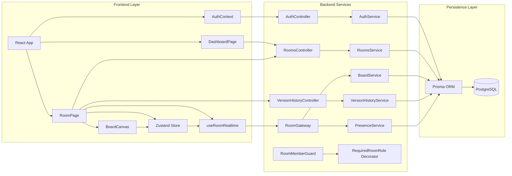
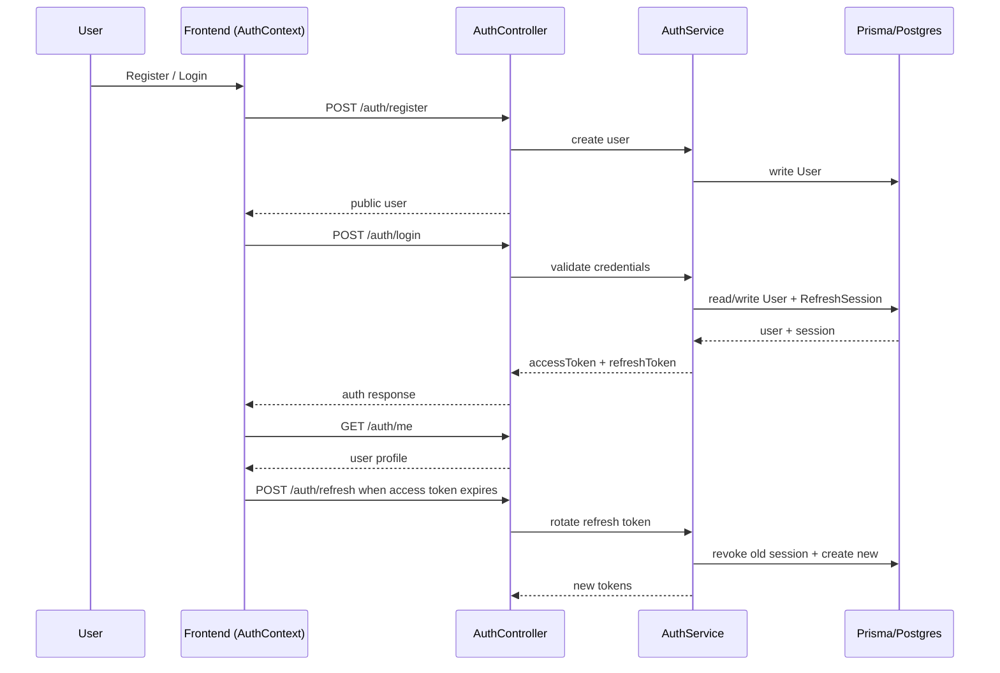
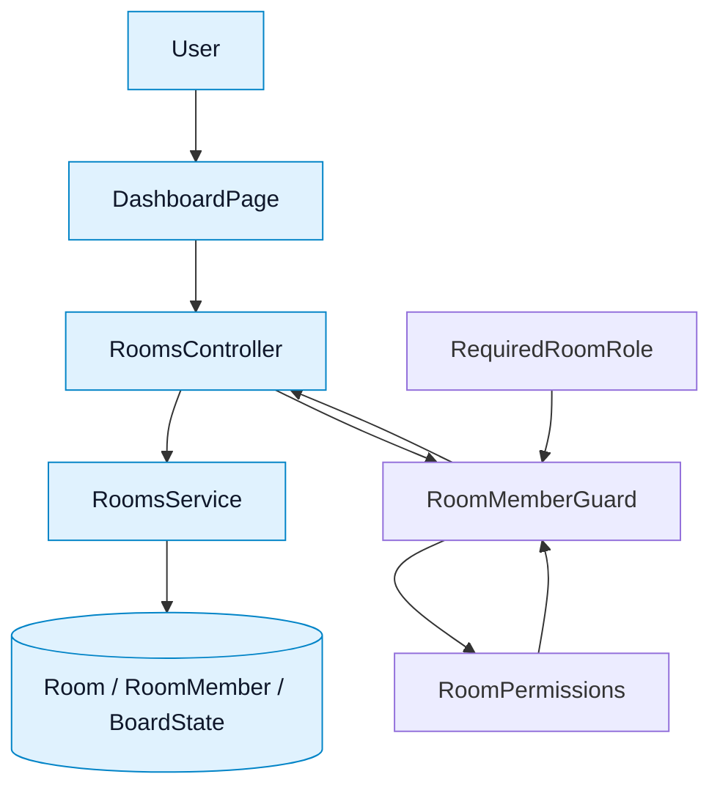
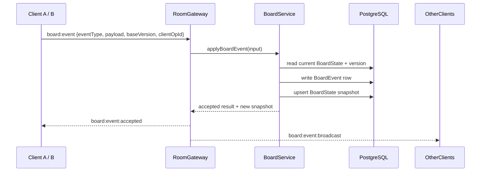
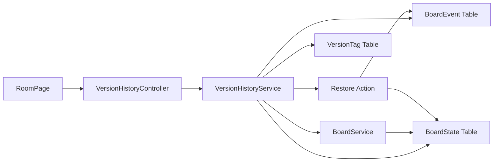
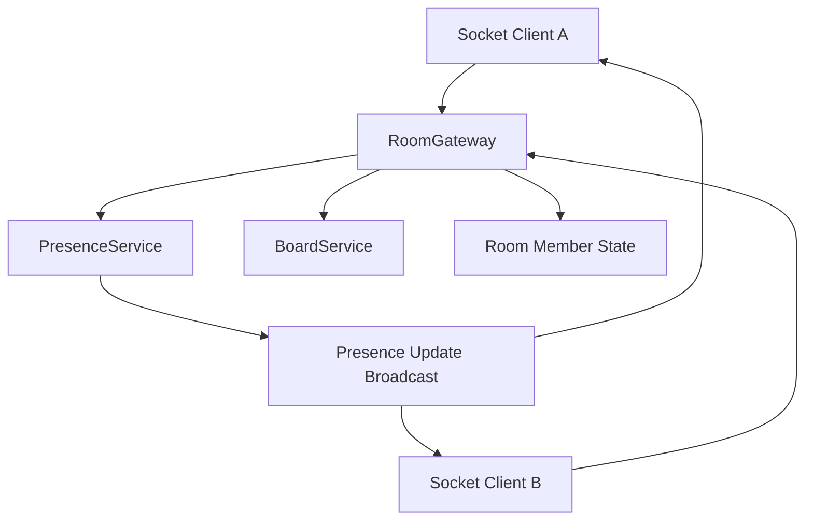
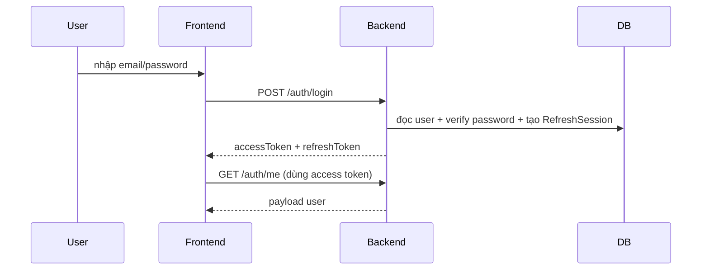
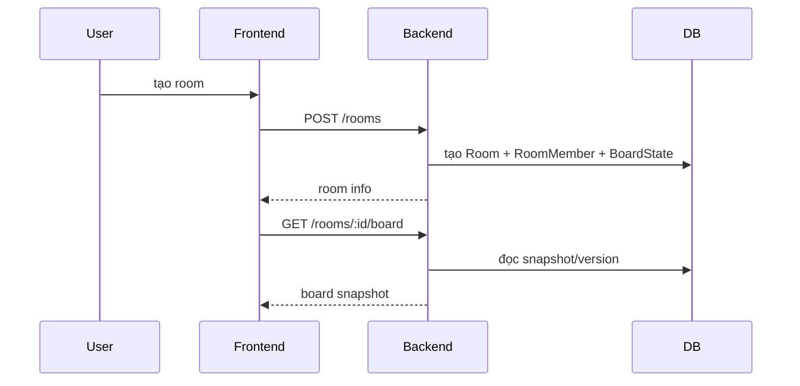
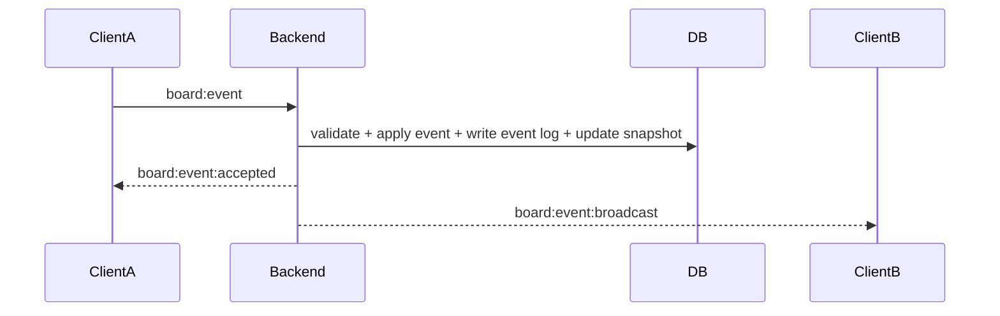

# Báo cáo chi tiết về repository: Real-Time Collaborative Tactical Whiteboard

## 1. Tổng quan dự án

Repository này là một hệ thống whiteboard cộng tác thời gian thực, chạy dưới kiến trúc monorepo với hai thành phần chính:

- Frontend: ứng dụng web React + Vite + TypeScript, dùng Konva để vẽ canvas và Zustand để quản lý state.
- Backend: API NestJS + TypeScript, cung cấp auth, phòng làm việc, quyền truy cập, board event sourcing và realtime qua Socket.IO.
- Shared package: định nghĩa các type dùng chung giữa frontend và backend để giảm lệch contract giữa các module.

Mục tiêu của hệ thống là cho nhiều người cùng làm việc trên một bảng vẽ kỹ thuật/tactical board, có thể tạo đối tượng (hình chữ nhật, vòng tròn, đường thẳng, văn bản), di chuyển, chỉnh sửa, xóa, theo dõi người đang online, xem lịch sử phiên bản và đánh dấu checkpoint.

### Đánh giá nhanh độ chính xác của tài liệu

Tài liệu này nhìn chung mô tả đúng kiến trúc hiện tại của repository. Các điểm cần lưu ý sau khi đối chiếu với code:

- Tên Socket.IO event trong shared package đã được đồng bộ lại với gateway/client, gồm `board:event:*`, `board:snapshot:restored`, cursor, selection, text lease/Yjs, và `room:error`.
- `POST /auth/register` hiện chỉ tạo user và trả public user; token chỉ được cấp qua `POST /auth/login` hoặc `POST /auth/refresh`.
- Version history chỉ trả tối đa 50 board event gần nhất trong danh sách tổng quan; restore tạo thêm một event `history.restore` và cập nhật snapshot.
- Redis hiện được dùng cho Socket.IO adapter và các trạng thái cộng tác tạm thời như cursor, object selection, text lease TTL.
- `README.md` hiện có phần mô tả cũ rằng business features còn để sau, trong khi code thực tế đã có auth, rooms, realtime board operations và schema đầy đủ.

### Cập nhật ngày 2026-07-07

- Multi-cursor/live cursor, comments/annotations, Redis-backed Socket.IO adapter đã có luồng end-to-end.
- Text editing lock đã được hoàn thiện theo mô hình soft lease: TTL 30 giây, renew mỗi 10 giây khi đang edit, chặn mở editor khi người khác giữ lease, và backend reject commit nếu lease thuộc user khác.
- Offline-first conflict handling đã có conflict drawer trong RoomPage. Operation replay bị reject được giữ trong IndexedDB với trạng thái `conflicted`, có thể discard hoặc retry against latest board/object version.
- Object conflict resolution hỗ trợ auto-merge stale update khi missed events chạm field khác nhau, và reject same-field conflict với details như `conflictingFields`.
- Text conflict hiện xử lý ở mức whole-text patch/lease conflict; live per-character multi-user editing bằng Yjs vẫn là phần mở rộng tương lai.
- Restore version hiện phát realtime `board:snapshot:restored` cho room, client đang mở board sẽ thay snapshot và clear undo/redo local.
- Board event payload mới được lưu dưới envelope versioned `{ schemaVersion, eventType, payload }`, đồng thời vẫn đọc được legacy raw payload.
- Frontend đã bỏ WebSocket-only transport để Socket.IO tự fallback polling, và object create đã có optimistic update/reconcile theo `clientOpId`.

---

## 2. Công nghệ và stack chính

### Frontend
- React 19
- Vite 7
- TypeScript
- Zustand cho state management
- React-Konva để render canvas và hình dạng trực quan
- Socket.IO client để kết nối realtime
- React Router DOM cho routing
- Tailwind CSS cho giao diện

### Backend
- NestJS 11
- TypeScript
- Prisma ORM + PostgreSQL
- Socket.IO server
- JWT access token + refresh token rotation
- Bcrypt cho password hashing
- Jest cho unit/integration test

### Shared layer
- Workspace package `packages/shared`
- Chứa các type chính như `BoardObject`, `BoardObjectType`, `RoomId`, `UserId`, `SocketEventName`

---

## 3. Cấu trúc thư mục chính

```text
.
├── backend/                  # NestJS API + Prisma + Socket.IO
│   ├── prisma/               # schema.prisma và migrations
│   └── src/
│       ├── app.module.ts
│       ├── auth/             # auth, JWT, refresh token
│       ├── board/            # event sourcing board logic
│       ├── permissions/      # room role guards
│       ├── prisma/           # Prisma service
│       ├── realtime/         # Socket.IO gateway + presence
│       ├── rooms/            # room CRUD, members, version history
│       └── users/            # user lookup, public projection
├── frontend/                 # React/Vite client
│   └── src/
│       ├── api/             # typed REST client
│       ├── auth/            # auth context and token storage
│       ├── board/           # board store, canvas, shape creation helpers
│       ├── components/      # UI blocks (panels, badges, member mgmt)
│       ├── pages/           # dashboard, room screen, auth pages
│       └── realtime/        # Socket.IO client hooks and history logic
├── packages/shared/          # shared TypeScript types
├── docker-compose.yml        # PostgreSQL/Redis services
└── README.md / CLAUDE.md     # documentation and operational guidance
```

---

## 4. Kiến trúc tổng thể

### 4.1 Sơ đồ kiến trúc tổng thể



### 4.2 Sơ đồ luồng Authentication và Session



### 4.3 Sơ đồ module Room, Membership và Phân quyền



### 4.4 Sơ đồ luồng Board Event Sourcing



### 4.5 Sơ đồ module Quản lý Phiên bản và Restore



### 4.6 Sơ đồ module Presence và Realtime Collaboration



### 4.7 Mô hình hệ thống

Hệ thống có thể được hiểu như một ứng dụng web full-stack với ba lớp chính:

1. Lớp UI (frontend)
   - Hiển thị dashboard, room, board canvas, người online, lịch sử phiên bản.
   - Gửi thao tác đến backend bằng REST hoặc Socket.IO.

2. Lớp dịch vụ nghiệp vụ (backend)
   - Xác thực người dùng, quản lý phòng, kiểm soát quyền, xử lý event board, lưu board state và lịch sử.

3. Lớp dữ liệu (PostgreSQL/Prisma)
   - Bảo quản users, rooms, memberships, board state, board events, version tags.

### 4.8 Nguyên tắc thiết kế quan trọng

- Board mutations là server-authoritative.
  - Client không nên tự tin rằng role của mình hợp lệ; mọi thay đổi board phải đi qua backend.
- Dữ liệu board dùng event sourcing.
  - Mỗi thao tác tạo/sửa/xóa đối tượng được ghi thành event và áp dụng lên snapshot.
- Realtime là một phần quan trọng của UX.
  - Socket.IO đảm bảo cập nhật state nhanh giữa nhiều người dùng trong cùng room.
- Quyền truy cập theo vai trò.
  - `OWNER`, `EDITOR`, `VIEWER` được kiểm tra bằng guards và decorators.

---

## 5. Thiết kế dữ liệu và schema chính

### 5.1 Prisma models

#### User
- Lưu thông tin đăng nhập và profile.
- Mỗi user có thể sở hữu nhiều room, là thành viên nhiều room, tạo nhiều board events.

#### RefreshSession
- Lưu refresh token đã hash để hỗ trợ rotation.
- Giúp backend revoke token cũ và tạo token mới sau refresh.

#### Room
- Đại diện cho một workspace/không gian cộng tác.
- Có `ownerId`, `inviteCode`, `members`, `boardState`, `boardEvents`.

#### RoomMember
- Liên kết user và room.
- Mỗi user trong một room có một `role` duy nhất.

#### BoardState
- Snapshot hiện tại của board cho một room.
- Gồm `version` và `snapshotJson`.

#### BoardEvent
- Append-only event log.
- Mỗi event có `roomId`, `version`, `eventType`, `payloadJson`, `actorId`.
- Đây là nguồn dữ liệu lịch sử cho replay, sync và version history.

#### VersionTag
- Chấm checkpoint tại một version cụ thể.
- Cung cấp tên gắn kết cho trạng thái board tại một thời điểm.

### 5.2 Mô hình dữ liệu board

Board state được biểu diễn như một snapshot object map:

```ts
snapshot = {
  objects: {
    [objectId]: BoardObject
  }
}
```

Mỗi object gồm:
- id
- type (`rectangle`, `circle`, `line`, `text`)
- vị trí x/y
- rotation
- version
- createdBy/updatedBy
- timestamps
- props/metadata
- deleted flag

Điều này cho phép backend áp dụng event create/update/delete lên snapshot một cách tuần tự.

---

## 6. Các module chính và vai trò

### 6.1 Backend modules

| Module | Vai trò |
|---|---|
| `AuthModule` | Đăng ký, đăng nhập, refresh token, logout, tạo JWT |
| `UsersModule` | Tra cứu user và chuyển sang public user projection |
| `RoomsModule` | CRUD room, quản lý member, invite code, version history |
| `BoardModule` | Xử lý event sourcing board, apply event, sync delta/snapshot |
| `RealtimeModule` | Socket.IO gateway, presence, room join, broadcast board events |
| `PermissionsModule` | Guards và decorators kiểm tra role phòng |
| `PrismaModule` | Service Prisma singleton |

### 6.2 Frontend modules

| Module | Vai trò |
|---|---|
| `auth/` | AuthContext, token storage, auto refresh session |
| `api/` | Client gọi REST API với error handling và auth header |
| `board/` | Zustand store, canvas helpers, shape generation |
| `realtime/` | Hook `useRoomRealtime`, quản lý Socket.IO, undo/redo queue |
| `pages/` | DashboardPage, RoomPage, auth pages |
| `components/` | MemberManagement, ObjectDetailPanel, UI primitives |
| `versions/` | Hiển thị version history và tag |

---

## 7. Các tính năng hiện có

### 7.1 Authentication và session

Hệ thống hỗ trợ:
- Register / Login
- Access token và refresh token
- Refresh token rotation (token cũ bị revoke khi refresh mới)
- Logout
- Auto restore session từ local storage

Luồng hoạt động:
1. User đăng ký qua `/auth/register`, backend tạo user và trả public profile.
2. User đăng nhập qua `/auth/login`, backend trả `accessToken` + `refreshToken`.
3. Frontend lưu refresh token và gọi API `/auth/me` để xác thực người dùng.
4. Khi access token hết hạn, `AuthContext` tự gọi `/auth/refresh`; backend revoke session cũ và tạo refresh session mới.

### 7.2 Quản lý phòng và thành viên

User có thể:
- Tạo room mới
- Xem danh sách room mình tham gia
- Tham gia room bằng invite code
- Xem danh sách member
- Thêm/xóa member (dựa trên quyền OWNER)
- Thay đổi role member

Room có vai trò:
- `OWNER`: quản trị phòng, có thể xóa phòng và thay đổi member
- `EDITOR`: có thể chỉnh sửa board
- `VIEWER`: chỉ xem

### 7.3 Bảng vẽ và thao tác board

Frontend cho phép người dùng:
- chọn công cụ
- vẽ rectangle/circle/line/text
- di chuyển object
- đổi kích thước / transform object
- chọn nhiều object bằng rubber-band selection
- xóa object
- undo / redo

Các thao tác board được gửi đến backend dưới dạng board event.

### 7.4 Realtime collaboration

Khi một user thao tác board:
1. Frontend tạo payload thao tác.
2. Gửi event qua Socket.IO tới backend.
3. Backend validate, áp dụng event, lưu vào DB.
4. Backend broadcast cho các client khác trong room.
5. Client khác cập nhật state board của mình.

### 7.5 Presence và người online

Backend dùng `PresenceService` để theo dõi:
- ai đang ở room nào
- mỗi user có thể có nhiều socket (multi-session)
- khi disconnect thì remove khỏi presence list

Frontend hiển thị danh sách online ở sidebar phòng.

### 7.6 Version history và checkpoint

Hệ thống cho phép:
- xem tối đa 50 sự kiện gần đây của board trong version history overview
- tạo tag/chấm checkpoint cho một version hiện có hoặc version 0
- restore về một version cụ thể

Những dữ liệu này lưu trong `BoardEvent` và `VersionTag`. Khi restore, backend replay events đến target version để dựng snapshot, ghi thêm một event `history.restore`, rồi cập nhật `BoardState` lên version mới.

---

## 8. Các luồng chính của hệ thống

### 8.1 Luồng đăng nhập và khởi tạo session



### 8.2 Luồng tạo phòng và mở board



### 8.3 Luồng thao tác board realtime



### 8.4 Luồng reconnect và sync

Khi client mất kết nối rồi reconnect:
1. Client gửi `room:join` kèm `lastKnownVersion`.
2. Backend kiểm tra khoảng cách giữa version hiện tại và version client biết.
3. Nếu chênh lệch từ 0 đến 50 event thì trả delta events.
4. Nếu không có `lastKnownVersion`, version âm, version lớn hơn server, hoặc chênh lệch hơn 50 event thì trả snapshot đầy đủ.

Đây là cơ chế rất quan trọng để client không cần load lại toàn bộ board mỗi lần reconnect.

### 8.5 Luồng undo/redo

Undo/redo được triển khai chủ yếu ở frontend:
- Mỗi thao tác board tạo một `BoardHistoryEntry` có `undo` và `redo` operation.
- Khi server chấp nhận event, frontend cập nhật stack undo/redo.
- Undo/redo không phụ thuộc vào server history logic; server chỉ validate version.

Điều này làm cho UX mượt nhưng có nhược điểm là logic phụ thuộc vào thứ tự ack và queue pending history.

---

## 9. Cách tương tác giữa các module

### 9.1 Frontend ↔ Backend REST

Sử dụng `ApiClient` ở frontend để gọi các API REST:
- auth APIs
- room APIs
- version history APIs
- board snapshot APIs

Ví dụ:
- DashboardPage gọi `listRooms`, `createRoom`, `joinByInviteCode`
- RoomPage gọi `getRoom`, `getBoardSnapshot`, `getVersionHistory`

Các endpoint REST chính đang có:

| Method | Endpoint | Vai trò | Quyền |
|---|---|---|---|
| `GET` | `/health` | Health check | Public |
| `POST` | `/auth/register` | Tạo user mới, trả public user | Public |
| `POST` | `/auth/login` | Đăng nhập, tạo access token và refresh token | Public |
| `POST` | `/auth/refresh` | Rotate refresh token và cấp token mới | Public với refresh token hợp lệ |
| `POST` | `/auth/logout` | Revoke refresh session | Public với refresh token hợp lệ |
| `GET` | `/auth/me` | Lấy user hiện tại | JWT |
| `GET` | `/rooms` | Danh sách room user tham gia | JWT |
| `POST` | `/rooms` | Tạo room, tạo OWNER membership và board state version 0 | JWT |
| `POST` | `/rooms/join` | Join room bằng invite code, mặc định role VIEWER | JWT |
| `GET` | `/rooms/:roomId` | Lấy room nếu là member | JWT |
| `PATCH` | `/rooms/:roomId` | Đổi tên room | OWNER |
| `DELETE` | `/rooms/:roomId` | Xóa room | OWNER |
| `GET` | `/rooms/:roomId/board` | Lấy board snapshot hiện tại | Member |
| `GET` | `/rooms/:roomId/members` | Danh sách member | Member |
| `POST` | `/rooms/:roomId/members` | Thêm member bằng userId | OWNER |
| `PATCH` | `/rooms/:roomId/members/:userId` | Đổi role member | OWNER |
| `DELETE` | `/rooms/:roomId/members/:userId` | Xóa member | OWNER |
| `GET` | `/rooms/:roomId/versions` | Lịch sử version gần đây và tags | Member |
| `POST` | `/rooms/:roomId/versions/tags` | Tạo checkpoint tag | EDITOR trở lên |
| `GET` | `/rooms/:roomId/versions/:version` | Chi tiết một version | Member |
| `POST` | `/rooms/:roomId/versions/:version/restore` | Restore board về version cũ | OWNER |

### 9.2 Frontend ↔ Backend Socket.IO

`useRoomRealtime` kết nối tới backend Socket.IO và handles:
- `room:join`
- `room:joined`
- `board:event`
- `board:event:accepted`
- `board:event:broadcast`
- `board:event:rejected`
- `presence:update`
- `shape:preview`

Luồng Socket.IO thực tế:

| Event | Chiều | Payload/ý nghĩa |
|---|---|---|
| `room:join` | Client -> Server | `{ roomId, lastKnownVersion }`; kiểm tra membership rồi join channel `room:${roomId}` |
| `room:joined` | Server -> Client | `{ role, users, syncMode, currentVersion, missedEvents? hoặc snapshot? }` |
| `presence:update` | Server -> Room | Danh sách user online, gom nhiều socket theo user |
| `board:event` | Client -> Server | `{ roomId, eventType, baseVersion, payload, clientOpId }` |
| `board:event:accepted` | Server -> Sender | Event đã được ghi, kèm version mới |
| `board:event:broadcast` | Server -> Other clients | Event đã được ghi để các client khác apply |
| `board:event:rejected` | Server -> Sender | Lý do reject: unauthorized, forbidden, validation, conflict, not found |
| `shape:preview` | Client -> Server -> Room | Preview transform tạm thời, không ghi DB |

### 9.3 Backend internal module flow

- `RoomGateway` nhận Socket.IO event.
- `BoardService` xử lý board event và cập nhật state.
- `PresenceService` cập nhật người online.
- `PrismaService` lưu vào PostgreSQL.
- `RoomMemberGuard` kiểm tra quyền tham gia room.

### 9.4 State flow trong frontend

- `RoomPage` tải snapshot ban đầu từ REST vào Zustand store.
- `useRoomRealtime` nhận realtime event và dùng `applyAccepted...Event` để cập nhật store.
- `BoardCanvas` render dữ liệu từ store và tạo local draft trong quá trình user vẽ.
- `useBoardStore` là nguồn dữ liệu trung tâm cho canvas.

---

## 10. Thiết kế realtime và event sourcing

### 10.1 Vì sao dùng event sourcing?

Vì hệ thống cần:
- ghi lại lịch sử thao tác
- replay state cho client mới hoặc reconnect
- hỗ trợ versioning và restore
- duy trì tính nhất quán khi nhiều client chỉnh sửa cùng lúc

### 10.2 Lifecycle của một board event

1. Client tạo event payload.
2. Gateway xác thực socket bằng JWT từ `handshake.auth.token` hoặc `Authorization` header.
3. Backend kiểm tra membership và quyền mutate board (`OWNER` hoặc `EDITOR`).
4. Backend kiểm tra board version.
5. Backend áp dụng event vào snapshot.
6. Backend ghi `BoardEvent` mới.
7. Backend update `BoardState.version` và snapshot.
8. Backend emit accepted cho sender và broadcast cho các client còn lại trong room.

### 10.3 Optimistic concurrency

Board service có logic kiểm tra:
- `baseVersion`: kiểm tra version hiện tại của board trước khi apply event.
- `expectedVersion`: khi update/delete object, kiểm tra version của object đó.

Nếu sai, backend ném conflict error.

Các event type board hiện được hỗ trợ:

| Event type | Payload chính | Kết quả |
|---|---|---|
| `object:create` | `{ object: { id, type, x, y, rotation?, props?, metadata? } }` | Tạo object mới, version object bắt đầu từ 1 |
| `object:update` | `{ objectId, expectedVersion?, patch }` | Merge `props`/`metadata`, cập nhật tọa độ/rotation và tăng version object |
| `object:delete` | `{ objectId, expectedVersion? }` | Soft-delete object bằng `deleted: true` và tăng version object |

---

## 11. Giao diện và trải nghiệm người dùng

### 11.1 Dashboard
- hiển thị danh sách phòng
- cho phép tạo phòng
- cho phép join bằng invite code
- cho phép xóa phòng (chỉ owner)

### 11.2 Room page
- header room, role badge, trạng thái kết nối realtime
- sidebar hiện presence và member management
- canvas chính để vẽ và tương tác object
- version history panel và tag creation

### 11.3 UX patterns
- toolbar chọn công cụ
- rubber-band selection
- zoom/ pan bằng chuột và phím tắt
- keyboard shortcuts: Ctrl+Z/Ctrl+Y, Delete, Ctrl+0

---

## 12. Môi trường vận hành và cấu hình

### Local development
- Cài dependencies: `pnpm install`
- Khởi động DB: `docker compose up -d postgres`
- Chạy frontend/backend: `pnpm dev`

### Ports mặc định
- Frontend: `http://localhost:5173`
- Backend: `http://localhost:3000`
- PostgreSQL: `5432`
- Redis: `6379` (declared but not yet used in core flow)

### Environment variables
- `DATABASE_URL`
- `JWT_ACCESS_SECRET`
- `JWT_ACCESS_TTL`
- `REFRESH_TOKEN_TTL_DAYS`
- `CORS_ORIGIN`

---

## 13. Testing hiện có

Repository có test cho nhiều layer:
- Backend:
  - `backend/src/auth/auth.controller.spec.ts`
  - `backend/src/board/board.service.spec.ts`
  - `backend/src/permissions/room-permissions.spec.ts`
  - `backend/src/realtime/room.gateway.spec.ts`
  - `backend/src/realtime/presence.service.spec.ts`
  - `backend/src/rooms/rooms.controller.spec.ts`
  - `backend/src/rooms/version-history.controller.spec.ts`
- Frontend:
  - `frontend/src/board/BoardCanvas.test.ts`
  - `frontend/src/board/boardStore.test.ts`
  - `frontend/src/realtime/useRoomRealtime.test.ts`
  - `frontend/src/versions/versionHistory.test.ts`

### Điểm mạnh của test suite
- Đã có kiểm thử cho auth, board logic, guards và các service quan trọng.

### Điểm còn thiếu
- Undo/redo đã match ACK/reject theo `clientOpId`; vẫn nên bổ sung integration tests nhiều client/reconnect để tăng độ tin cậy.
- Restore version đã có realtime broadcast; vẫn nên bổ sung test trình duyệt thật để xác nhận nhiều client cập nhật đồng thời.
- Chưa thấy test end-to-end chạy qua trình duyệt thật trong package scripts; các file `frontend/test/*.ts` có vẻ là script/manual test hỗ trợ phát triển.

---

## 14. Điểm mạnh của hệ thống

1. Kiến trúc rõ ràng giữa frontend/backend/shared.
2. Dùng event sourcing cho board state, phù hợp với collaboration real-time.
3. Có cơ chế auth và role-based permission rõ ràng.
4. Realtime presence và room membership được thiết kế khá chặt chẽ.
5. Có version history và restore cơ bản, tăng giá trị cho whiteboard.
6. Dễ mở rộng thêm tính năng như cursor sharing, comments, locks, export/import.

---

## 15. Trạng thái các giới hạn đã rà soát

Các giới hạn lớn được rà soát gần đây đã được xử lý ở mức implementation hiện tại:

- Undo/redo ACK/reject đã match bằng `clientOpId`, không còn phụ thuộc FIFO đơn giản.
- `SocketEventName` trong shared package đã được đồng bộ với gateway/client.
- Socket.IO client đã dùng fallback mặc định của Socket.IO thay vì WebSocket-only.
- Board creation đã có optimistic update và reconcile/rollback theo `clientOpId`.
- Board event payload mới đã có schema envelope versioned; legacy raw payload vẫn được hỗ trợ khi đọc/replay.
- Restore version đã phát `board:snapshot:restored`; client đang ở trong room không cần reload để thấy snapshot mới.

Các điểm còn cần cải thiện:

- Undo/redo vẫn là logic client-side, nên cần thêm integration/E2E tests cho nhiều client, reconnect và ACK out-of-order.
- Offline optimistic create chỉ tồn tại trong phiên hiện tại; sau reload, IndexedDB outbox vẫn là source of truth cho replay.
- Một số nghiệp vụ nâng cao như ownership transfer vẫn chưa hoàn thiện.
- Collaborative text hiện xử lý conflict bằng soft lease và whole-text patch; live per-character multi-user editing bằng Yjs vẫn là hướng mở rộng tương lai.

---

## 16. Kết luận

Repository này là một nền tảng whiteboard cộng tác thời gian thực khá đầy đủ về mặt kiến trúc và nghiệp vụ. Nó không chỉ là một demo UI đơn giản mà là một hệ thống có cấu trúc rõ ràng với:

- auth và role management
- realtime collaboration
- event-sourced board state
- room membership và presence
- version history và restore

Nếu tiếp tục phát triển, đây là một codebase rất phù hợp để mở rộng thêm các tính năng cao cấp như:
- export board to image/PDF
- ownership transfer và audit log nâng cao
- live per-character collaborative text editing bằng Yjs
- automated browser E2E tests cho nhiều client realtime
- production hardening cho deploy nhiều node, metrics, tracing và rate limiting
