# Báo cáo chi tiết repository: Real-Time Collaborative Tactical Whiteboard

## 1. Tóm tắt hiện trạng

Repository là một pnpm monorepo cho whiteboard cộng tác thời gian thực. Hệ thống gồm:

- Frontend: ứng dụng web React + Vite + TypeScript, dùng Konva để vẽ canvas và Zustand để quản lý state.
- Backend: API NestJS + TypeScript, cung cấp auth, phòng làm việc, quyền truy cập, board event sourcing và realtime qua Socket.IO.
- Shared package: định nghĩa các type dùng chung giữa frontend và backend để giảm lệch contract giữa các module.

Mục tiêu của hệ thống là cho nhiều người cùng làm việc trên một bảng vẽ kỹ thuật/tactical board, có thể tạo đối tượng (hình chữ nhật, vòng tròn, đường thẳng, văn bản), di chuyển, chỉnh sửa, xóa, theo dõi người đang online, xem lịch sử phiên bản và đánh dấu checkpoint.

### Đánh giá nhanh độ chính xác của tài liệu

Tài liệu này nhìn chung mô tả đúng kiến trúc hiện tại của repository. Các điểm cần lưu ý sau khi đối chiếu với code:

- Tên Socket.IO event trong shared package đã được đồng bộ lại với gateway/client, gồm `board:event:*`, `board:snapshot:restored`, cursor, selection, text lease/Yjs, và `room:error`.
- `POST /auth/register` hiện chỉ tạo user và trả public user; token chỉ được cấp qua `POST /auth/login` hoặc `POST /auth/refresh`.
- Version history chỉ trả tối đa 50 board event gần nhất trong danh sách tổng quan; restore tạo thêm một event `history.restore` và cập nhật snapshot.
- Redis hiện được dùng cho Socket.IO adapter và các trạng thái cộng tác tạm thời như cursor, object selection, text lease TTL.
- `README.md` hiện có phần mô tả cũ rằng business features còn để sau, trong khi code thực tế đã có auth, rooms, realtime board operations và schema đầy đủ.

### Cập nhật ngày 2026-07-07 (cuối ngày)

**UI/Design System:**
- Chuyển toàn bộ frontend sang Tailwind CSS với design system "Tactical Precision" (dark theme, glassmorphism, Inter + JetBrains Mono fonts).
- Component library: GlassPanel, PageHeading, StatusChip, RoleBadge, ToolButton, SectionHeading, Toaster (toast notifications).
- Responsive mobile support với bottom navigation bar.
- Login/Register/Dashboard/RoomPage được thiết kế lại hoàn toàn theo dark theme.

**Board & Canvas:**
- Canvas nền trắng ("Paper Mode") với grid tự scale theo viewport zoom level.
- Toolbar nổi bên trái (Select, Rectangle, Circle, Line, Text, Pan).
- **Multi-select**: Shift+Click để toggle, kéo chuột rubber-band để chọn vùng.
- **Keyboard shortcuts**: Ctrl+Z/Y (undo/redo), Delete (xóa), Ctrl+/-/0 (zoom), Escape.
- **Rotation**: Transformer `rotateEnabled=true` cho tất cả shape types.
- Object Detail Panel hiển thị khi chọn 1 object (ID, type, position, rotation, size, style, version, creator).

**Undo/Redo:**
- Đã fix: bỏ `expectedVersion` khỏi undo payload để undo luôn thành công bất kể intermediate operations.
- `createHistoryEntry` hỗ trợ cả 4 loại shape (đã fix type guard `isCreateBoardObjectPayload`).
- Undo/redo stack không bị clear sau restore (người dùng có thể undo các thao tác trước restore).

**Member Management:**
- Panel quản lý thành viên trong RoomPage (bên trái): Owner xem, đổi role (OWNER/EDITOR/VIEWER), xóa member.
- Join room bằng invite code (hiển thị code trên Dashboard room cards, nút copy).

**Comments:**
- API CRUD comments: `GET/POST /rooms/:id/comments`, `PATCH/DELETE /rooms/:id/comments/:commentId`.
- Comment model trong Prisma schema.

**Docker:**
- Dockerfile single-stage build cho backend.
- docker-compose.yml: PostgreSQL + Backend + Redis services.

**Code Review & Bug Fixes (9 HIGH+MEDIUM bugs fixed):**
- Rubber-band selection: fix double mouseup handlers + wrong text bounds.
- `handleShapePreview`: thêm membership check (trước đây bỏ qua).
- `getBoardEventRejectionReason`: phân biệt `TEXT_LEASE_CONFLICT` vs `VERSION_CONFLICT`.
- `shape:preview setTimeout`: clean up khi unmount (dùng ref).
- `loadVersionHistory`/`loadComments`: guard `mountedRef` chống setState sau unmount.
- Offline operation IndexedDB failures: thêm `.catch()` handler.
- Text lease interval: clear sau snapshot restore.
- Redis: `lazyConnect` + `retryStrategy: () => null` để không spam log khi Redis unavailable.

---

## 2. Công nghệ và stack chính

### Frontend
- React 19
- Vite 7
- TypeScript
- Zustand cho state management
- React-Konva để render canvas và hình dạng trực quan
- Socket.IO client để kết nối realtime
- React Router DOM cho routing
- Tailwind CSS cho giao diện

### Backend
- NestJS 11
- TypeScript
- Prisma ORM + PostgreSQL
- Socket.IO server
- JWT access token + refresh token rotation
- Bcrypt cho password hashing
- Jest cho unit/integration test

### Shared layer
- Workspace package `packages/shared`
- Chứa các type chính như `BoardObject`, `BoardObjectType`, `RoomId`, `UserId`, `SocketEventName`

---

## 3. Cấu trúc thư mục chính

```text
.
├── backend/
│   ├── Dockerfile
│   ├── prisma/
│   │   ├── schema.prisma
│   │   └── migrations/
│   └── src/
│       ├── app.module.ts
│       ├── auth/             # auth, JWT, refresh token
│       ├── board/            # event sourcing board logic
│       ├── permissions/      # room role guards
│       ├── prisma/           # Prisma service
│       ├── realtime/         # Socket.IO gateway + presence
│       ├── rooms/            # room CRUD, members, version history
│       └── users/            # user lookup, public projection
├── frontend/                 # React/Vite client
│   ├── test/               # manual test scripts (collab, undo, invite, flow)
│   └── src/
│       ├── api/             # typed REST client (rooms, auth, comments, members)
│       ├── auth/            # auth context and token storage
│       ├── board/           # board store, canvas, BoardCanvas, shape helpers
│       ├── components/
│       │   ├── board/       # ObjectDetailPanel, MemberManagement
│       │   ├── layout/      # AppHeader, MobileNav
│       │   └── ui/          # GlassPanel, PageHeading, StatusChip, RoleBadge, ToolButton, SectionHeading, Toaster
│       ├── config/          # env config
│       ├── layout/          # AppLayout
│       ├── pages/           # DashboardPage, RoomPage, LoginPage, RegisterPage, NotFoundPage
│       ├── realtime/        # useRoomRealtime hook, offlineOutbox
│       └── versions/        # versionHistory helper
├── packages/shared/          # shared TypeScript types
├── docker-compose.yml        # PostgreSQL/Redis services
└── README.md / CLAUDE.md     # documentation and operational guidance
```

---

## 4. Kiến trúc tổng thể

### 4.1 Sơ đồ kiến trúc tổng thể

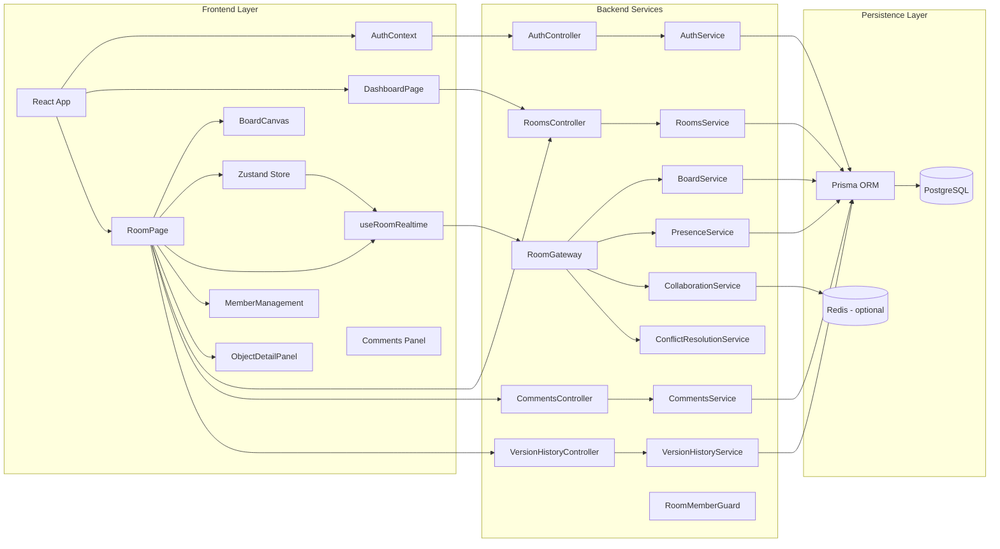

### 4.2 Sơ đồ luồng Authentication và Session

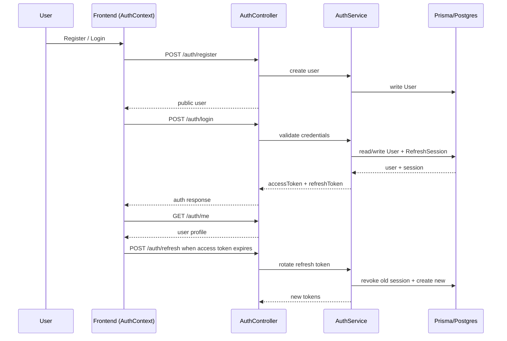

### 4.3 Sơ đồ module Room, Membership và Phân quyền

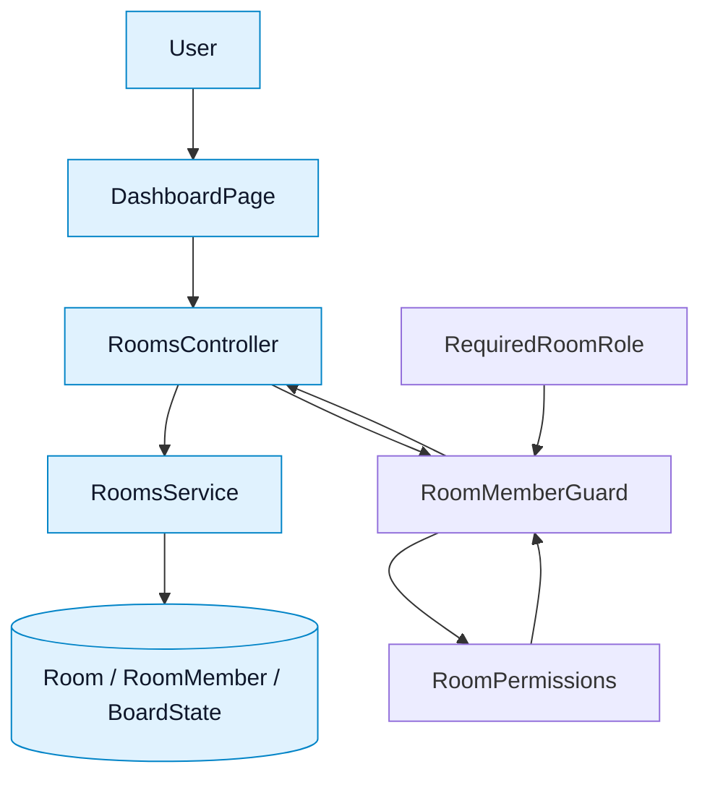

### 4.4 Sơ đồ luồng Board Event Sourcing

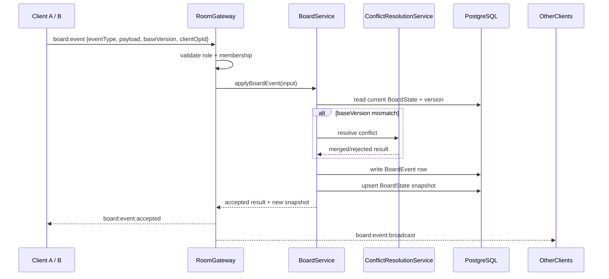

### 4.4b Sơ đồ Undo/Redo Flow

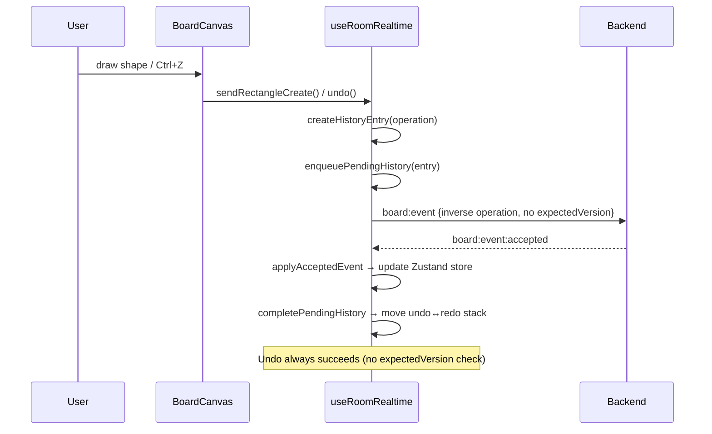

### 4.4c Sơ đồ Rubber-band Multi-Select

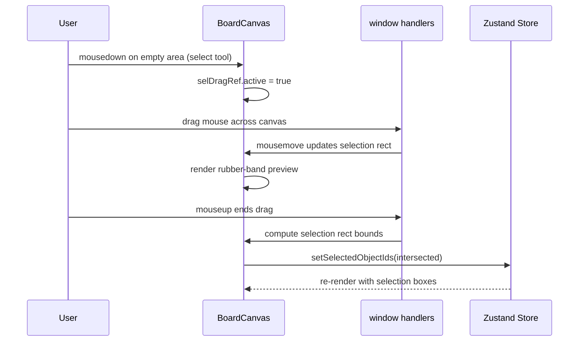

### 4.5 Sơ đồ module Quản lý Phiên bản và Restore

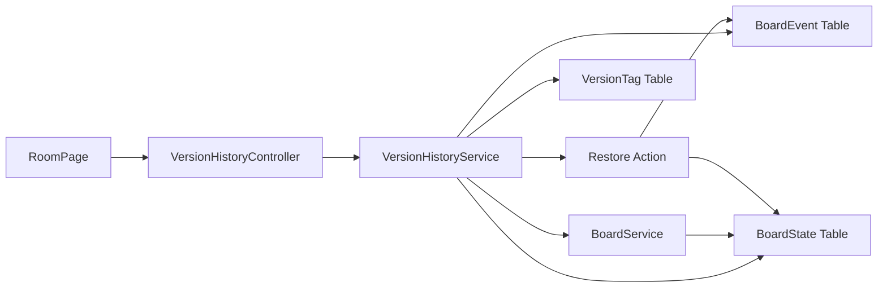

### 4.5b Sơ đồ luồng Restore Version

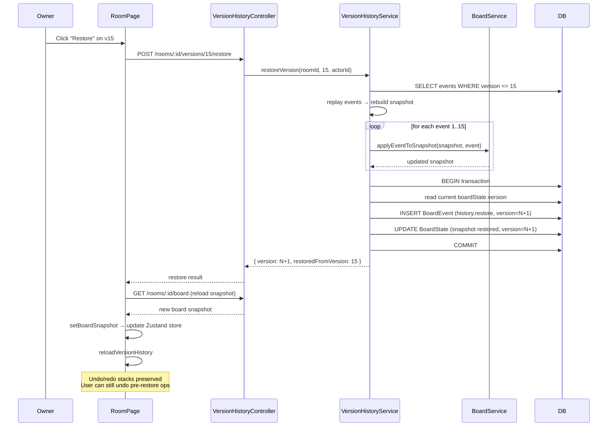

### 4.6 Sơ đồ module Presence và Realtime Collaboration

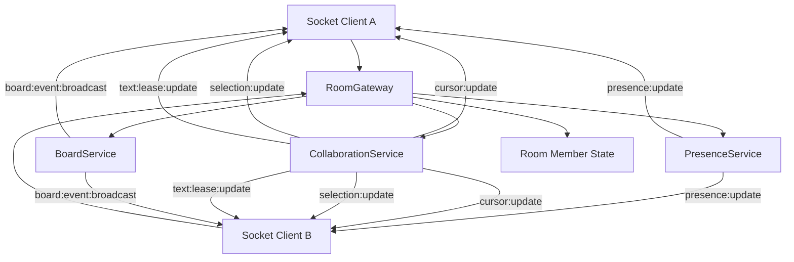

### 4.6b Sơ đồ Member Management + Invite Code

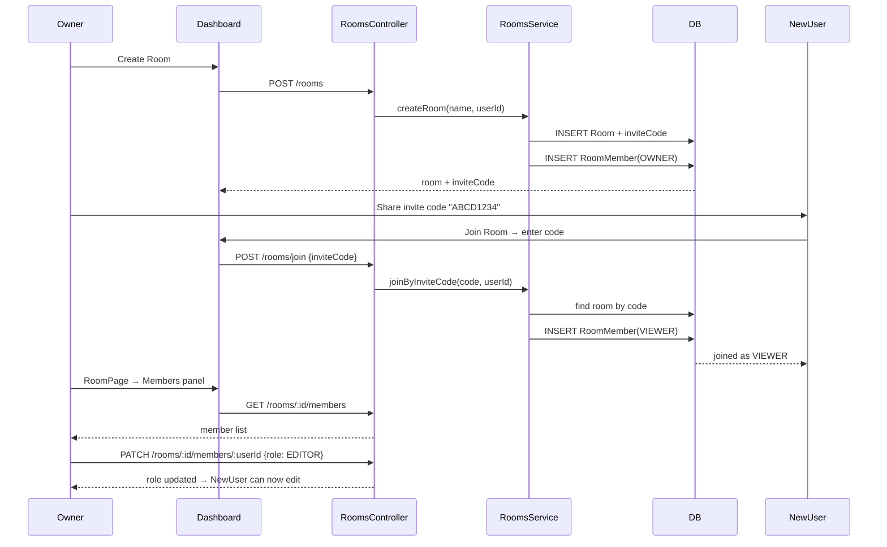

### 4.6c Sơ đồ Comments Flow

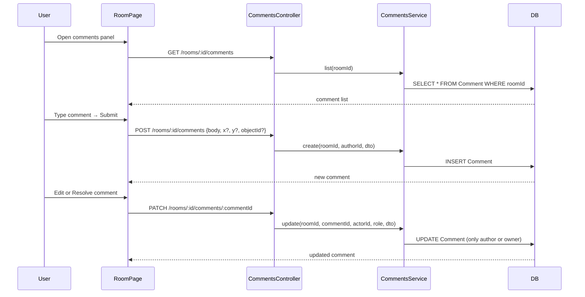

### 4.7 Mô hình hệ thống

Hệ thống có thể được hiểu như một ứng dụng web full-stack với ba lớp chính:

1. Lớp UI (frontend)
   - Hiển thị dashboard, room, board canvas, người online, lịch sử phiên bản.
   - Gửi thao tác đến backend bằng REST hoặc Socket.IO.

2. Lớp dịch vụ nghiệp vụ (backend)
   - Xác thực người dùng, quản lý phòng, kiểm soát quyền, xử lý event board, lưu board state và lịch sử.

3. Lớp dữ liệu (PostgreSQL/Prisma)
   - Bảo quản users, rooms, memberships, board state, board events, version tags.

### 4.8 Nguyên tắc thiết kế quan trọng

- Board mutations là server-authoritative.
  - Client không nên tự tin rằng role của mình hợp lệ; mọi thay đổi board phải đi qua backend.
- Dữ liệu board dùng event sourcing.
  - Mỗi thao tác tạo/sửa/xóa đối tượng được ghi thành event và áp dụng lên snapshot.
- Realtime là một phần quan trọng của UX.
  - Socket.IO đảm bảo cập nhật state nhanh giữa nhiều người dùng trong cùng room.
- Quyền truy cập theo vai trò.
  - `OWNER`, `EDITOR`, `VIEWER` được kiểm tra bằng guards và decorators.

---

## 5. Thiết kế dữ liệu và schema chính

### 5.1 Prisma models

#### User
- Lưu thông tin đăng nhập và profile.
- Mỗi user có thể sở hữu nhiều room, là thành viên nhiều room, tạo nhiều board events.

#### RefreshSession
- Lưu refresh token đã hash để hỗ trợ rotation.
- Giúp backend revoke token cũ và tạo token mới sau refresh.

#### Room
- Đại diện cho một workspace/không gian cộng tác.
- Có `ownerId`, `inviteCode`, `members`, `boardState`, `boardEvents`.

#### RoomMember
- Liên kết user và room.
- Mỗi user trong một room có một `role` duy nhất.

#### BoardState
- Snapshot hiện tại của board cho một room.
- Gồm `version` và `snapshotJson`.

#### BoardEvent
- Append-only event log.
- Mỗi event có `roomId`, `version`, `eventType`, `payloadJson`, `actorId`.
- Đây là nguồn dữ liệu lịch sử cho replay, sync và version history.

#### VersionTag
- Chấm checkpoint tại một version cụ thể.
- Cung cấp tên gắn kết cho trạng thái board tại một thời điểm.

#### Comment
- Bình luận gắn vào room, có thể gắn vào object (`objectId`) hoặc tọa độ canvas (`x`, `y`).
- Có trạng thái `resolved`. Chỉ author hoặc OWNER mới được sửa/xóa.

#### TextDocument
- Lưu trữ Yjs document cho collaborative text editing (tương lai).
- Mỗi text object có một TextDocument riêng với `ydoc` binary.

### 5.2 Mô hình dữ liệu board

Board state được biểu diễn như một snapshot object map:

```ts
{
  schemaVersion: 1,
  eventType: 'object:update',
  payload: { objectId, expectedVersion, patch }
}
```

Mỗi object gồm:
- id
- type (`rectangle`, `circle`, `line`, `text`)
- vị trí x/y
- rotation
- version
- createdBy/updatedBy
- timestamps
- props/metadata
- deleted flag

Điều này cho phép backend áp dụng event create/update/delete lên snapshot một cách tuần tự.

---

## 6. Các module chính và vai trò

### 6.1 Backend modules

| Module | Vai trò |
|---|---|
| `AuthModule` | Đăng ký, đăng nhập, refresh token, logout, tạo JWT |
| `UsersModule` | Tra cứu user và chuyển sang public user projection |
| `RoomsModule` | CRUD room, quản lý member, invite code, version history, comments API |
| `BoardModule` | Xử lý event sourcing board, apply event, sync delta/snapshot, conflict resolution |
| `RealtimeModule` | Socket.IO gateway, presence, room join, broadcast board events |
| `CollaborationModule` | Multi-cursor, live selection, text lease (soft lock TTL), Yjs sync (Redis adapter optional) |
| `PermissionsModule` | Guards và decorators kiểm tra role phòng |
| `PrismaModule` | Service Prisma singleton |

### 6.2 Frontend modules

| Module | Vai trò |
|---|---|
| `auth/` | AuthContext, token storage, auto refresh session, `runWithAuth` retry wrapper |
| `api/` | Typed REST client (`ApiClient`) — auth, rooms, members, comments, version history, invite code |
| `board/` | Zustand store (`useBoardStore`), BoardCanvas (Konva Stage + Transformer + shape rendering), shape creation helpers cho rectangle/circle/line/text |
| `realtime/` | Hook `useRoomRealtime` — Socket.IO lifecycle, undo/redo queue (FIFO `pendingHistoryRef`), presence, delta/snapshot sync, `offlineOutbox` (IndexedDB queue cho offline operations) |
| `pages/` | DashboardPage (room cards + invite code + delete), RoomPage (canvas + panels + comments), LoginPage, RegisterPage |
| `components/board/` | `MemberManagement` (owner chỉnh role/xóa), `ObjectDetailPanel` (thông tin object khi chọn) |
| `components/ui/` | GlassPanel, PageHeading, StatusChip, RoleBadge, ToolButton, SectionHeading, Toaster |
| `components/layout/` | AppHeader (navbar với glassmorphism), MobileNav (bottom bar mobile) |
| `versions/` | `formatVersionEventType`, `getVersionActorLabel`, `getTagsForVersion`, `canCreateVersionTag` |

---

## 7. Các tính năng hiện có

### 7.1 Authentication và session

Hệ thống hỗ trợ:
- Register / Login
- Access token và refresh token
- Refresh token rotation (token cũ bị revoke khi refresh mới)
- Logout
- Auto restore session từ local storage

Luồng hoạt động:
1. User đăng ký qua `/auth/register`, backend tạo user và trả public profile.
2. User đăng nhập qua `/auth/login`, backend trả `accessToken` + `refreshToken`.
3. Frontend lưu refresh token và gọi API `/auth/me` để xác thực người dùng.
4. Khi access token hết hạn, `AuthContext` tự gọi `/auth/refresh`; backend revoke session cũ và tạo refresh session mới.

### 7.2 Quản lý phòng và thành viên

User có thể:
- Tạo room mới
- Xem danh sách room mình tham gia
- Tham gia room bằng invite code
- Xem danh sách member
- Thêm/xóa member (dựa trên quyền OWNER)
- Thay đổi role member

Room có vai trò:
- `OWNER`: quản trị phòng, có thể xóa phòng và thay đổi member
- `EDITOR`: có thể chỉnh sửa board
- `VIEWER`: chỉ xem

### 7.3 Bảng vẽ và thao tác board

Frontend cho phép người dùng:
- chọn công cụ
- vẽ rectangle/circle/line/text
- di chuyển object
- đổi kích thước / transform object
- chọn nhiều object bằng rubber-band selection
- xóa object
- undo / redo

Các thao tác board được gửi đến backend dưới dạng board event.

### 7.4 Realtime collaboration

Khi một user thao tác board:
1. Frontend tạo payload thao tác.
2. Gửi event qua Socket.IO tới backend.
3. Backend validate, áp dụng event, lưu vào DB.
4. Backend broadcast cho các client khác trong room.
5. Client khác cập nhật state board của mình.

### 7.5 Presence và người online

Backend dùng `PresenceService` để theo dõi:
- ai đang ở room nào
- mỗi user có thể có nhiều socket (multi-session)
- khi disconnect thì remove khỏi presence list

Frontend hiển thị danh sách online ở sidebar phòng.

### 7.6 Version history và checkpoint

Hệ thống cho phép:
- xem tối đa 50 sự kiện gần đây của board trong version history overview
- tạo tag/chấm checkpoint cho một version hiện có hoặc version 0
- restore về một version cụ thể

Những dữ liệu này lưu trong `BoardEvent` và `VersionTag`. Khi restore, backend replay events đến target version để dựng snapshot, ghi thêm một event `history.restore`, rồi cập nhật `BoardState` lên version mới.

---

## 8. Các luồng chính của hệ thống

### 8.1 Luồng đăng nhập và khởi tạo session

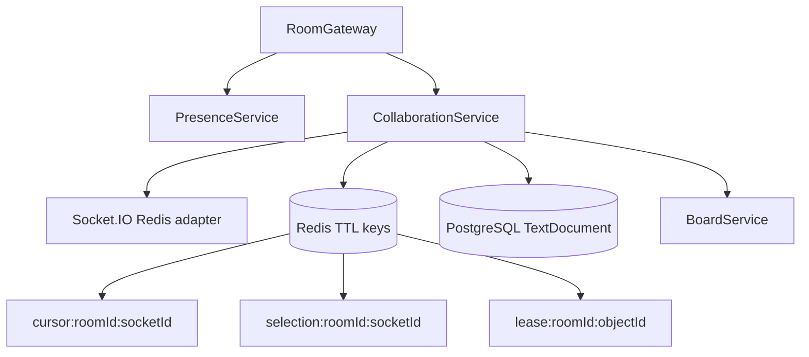

Collaboration design xử lý:

- Socket authentication qua `handshake.auth.token` hoặc `Authorization` header.
- `PresenceService` gom nhiều socket của cùng user thành một presence record trong process.
- `CollaborationService.attachSocketAdapter()` gắn Redis adapter nếu có `REDIS_URL`.
- Cursor TTL 10 giây, selection TTL 30 giây, text lease TTL 30 giây.
- Disconnect xóa cursor, selection, text lease của socket và broadcast remove/update event.

### 6.6 Text editing

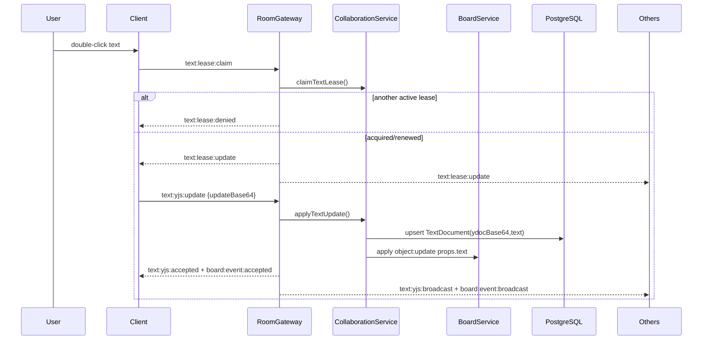

Soft lease xử lý tranh chấp edit text ở mức UX và backend guard. Yjs state được persist, nhưng UI hiện vẫn commit toàn text qua textarea; chưa phải editor CRDT multi-cursor per-character hoàn chỉnh.

### 6.7 Version history và restore

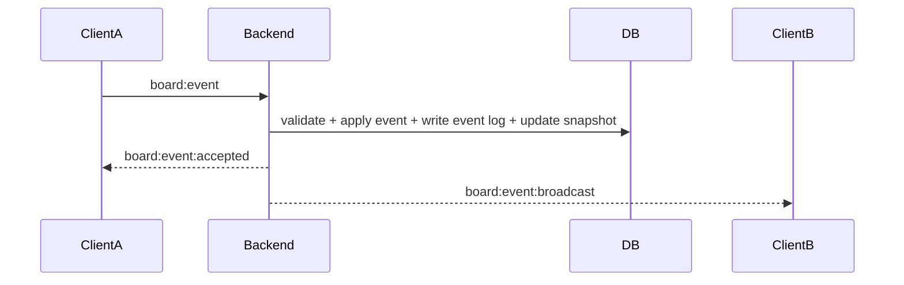

### 8.4 Luồng reconnect và sync

Khi client mất kết nối rồi reconnect:
1. Client gửi `room:join` kèm `lastKnownVersion`.
2. Backend kiểm tra khoảng cách giữa version hiện tại và version client biết.
3. Nếu chênh lệch từ 0 đến 50 event thì trả delta events.
4. Nếu không có `lastKnownVersion`, version âm, version lớn hơn server, hoặc chênh lệch hơn 50 event thì trả snapshot đầy đủ.

Đây là cơ chế rất quan trọng để client không cần load lại toàn bộ board mỗi lần reconnect.

### 8.5 Luồng undo/redo

Undo/redo được triển khai chủ yếu ở frontend:
- Mỗi thao tác board tạo một `BoardHistoryEntry` có `undo` (inverse operation) và `redo` (original operation).
- **Create → undo=delete**: Xóa object vừa tạo. Undo luôn gửi `object:delete` **không kèm expectedVersion** để tránh conflict sau nhiều thao tác trung gian.
- **Update → undo=update (restore previous state)**: Gửi `object:update` với patch khôi phục giá trị cũ. ExpectedVersion bị xóa khỏi undo payload.
- **Delete → undo=create**: Tạo lại object từ bản sao trước khi xóa.
- Khi server ACK event, frontend gọi `completePendingHistory` để chuyển entry từ `undoStack` ↔ `redoStack`.
- `pendingHistoryCount > 0` sẽ chặn undo/redo cho đến khi pending operation hoàn thành.
- Undo/redo stack **không bị clear sau restore** — user có thể undo các thao tác trước khi restore.
- Keyboard shortcuts: `Ctrl+Z` (undo), `Ctrl+Shift+Z` / `Ctrl+Y` (redo).

### 8.6 Luồng xóa room

- Owner chọn "Delete Room" trên Dashboard card → hiện confirmation dialog.
- Xác nhận → `DELETE /rooms/:roomId` → room và tất cả dữ liệu liên quan (members, board state, events, comments) bị xóa cascade.
- Room bị xóa khỏi danh sách hiển thị và toast notification hiện thông báo thành công.

---

## 9. Cách tương tác giữa các module

### 9.1 Frontend ↔ Backend REST

Sử dụng `ApiClient` ở frontend để gọi các API REST:
- auth APIs
- room APIs
- version history APIs
- board snapshot APIs

Ví dụ:
- DashboardPage gọi `listRooms`, `createRoom`, `joinByInviteCode`
- RoomPage gọi `getRoom`, `getBoardSnapshot`, `getVersionHistory`

Các endpoint REST chính đang có:

| Method | Endpoint | Auth/Role | Purpose |
|---|---|---|---|
| `GET` | `/health` | Health check | Public |
| `POST` | `/auth/register` | Tạo user mới, trả public user | Public |
| `POST` | `/auth/login` | Đăng nhập, tạo access token và refresh token | Public |
| `POST` | `/auth/refresh` | Rotate refresh token và cấp token mới | Public với refresh token hợp lệ |
| `POST` | `/auth/logout` | Revoke refresh session | Public với refresh token hợp lệ |
| `GET` | `/auth/me` | Lấy user hiện tại | JWT |
| `GET` | `/rooms` | Danh sách room user tham gia | JWT |
| `POST` | `/rooms` | Tạo room, tạo OWNER membership và board state version 0 | JWT |
| `POST` | `/rooms/join` | Join room bằng invite code, mặc định role VIEWER | JWT |
| `GET` | `/rooms/:roomId` | Lấy room nếu là member | JWT |
| `PATCH` | `/rooms/:roomId` | Đổi tên room | OWNER |
| `DELETE` | `/rooms/:roomId` | Xóa room | OWNER |
| `GET` | `/rooms/:roomId/board` | Lấy board snapshot hiện tại | Member |
| `GET` | `/rooms/:roomId/members` | Danh sách member | Member |
| `POST` | `/rooms/:roomId/members` | Thêm member bằng userId | OWNER |
| `PATCH` | `/rooms/:roomId/members/:userId` | Đổi role member | OWNER |
| `DELETE` | `/rooms/:roomId/members/:userId` | Xóa member | OWNER |
| `GET` | `/rooms/:roomId/versions` | Lịch sử version gần đây và tags | Member |
| `POST` | `/rooms/:roomId/versions/tags` | Tạo checkpoint tag | EDITOR trở lên |
| `GET` | `/rooms/:roomId/versions/:version` | Chi tiết một version | Member |
| `POST` | `/rooms/:roomId/versions/:version/restore` | Restore board về version cũ | OWNER |
| `GET` | `/rooms/:roomId/comments` | Danh sách comment trong room | Member |
| `POST` | `/rooms/:roomId/comments` | Tạo comment (có thể gắn vào objectId hoặc x/y) | Member |
| `PATCH` | `/rooms/:roomId/comments/:commentId` | Sửa body/resolved của comment | Author hoặc OWNER |
| `DELETE` | `/rooms/:roomId/comments/:commentId` | Xóa comment | Author hoặc OWNER |

### 9.2 Frontend ↔ Backend Socket.IO

`useRoomRealtime` kết nối tới backend Socket.IO và handles:
- `room:join`
- `room:joined`
- `board:event`
- `board:event:accepted`
- `board:event:broadcast`
- `board:event:rejected`
- `presence:update`
- `shape:preview`

Luồng Socket.IO thực tế:

| Event | Chiều | Payload/ý nghĩa |
|---|---|---|
| `room:join` | Client -> Server | `{ roomId, lastKnownVersion }`; kiểm tra membership rồi join channel `room:${roomId}` |
| `room:joined` | Server -> Client | `{ role, users, syncMode, currentVersion, missedEvents? hoặc snapshot? }` |
| `presence:update` | Server -> Room | Danh sách user online, gom nhiều socket theo user |
| `board:event` | Client -> Server | `{ roomId, eventType, baseVersion, payload, clientOpId }` |
| `board:event:accepted` | Server -> Sender | Event đã được ghi, kèm version mới |
| `board:event:broadcast` | Server -> Other clients | Event đã được ghi để các client khác apply |
| `board:event:rejected` | Server -> Sender | Lý do reject: unauthorized, forbidden, validation, conflict, not found |
| `shape:preview` | Client -> Server -> Room | Preview transform tạm thời, không ghi DB (cần membership check) |
| `cursor:update` | Client -> Server | `{ roomId, position }` — vị trí chuột, broadcast qua CollaborationService |
| `selection:update` | Client -> Server | `{ roomId, objectIds, mode }` — object đang được chọn |
| `text:lease:claim` | Client -> Server | Xin lease để edit text object (TTL 30s, renew 10s) |
| `text:lease:release` | Client -> Server | Giải phóng lease khi edit xong |
| `text:lease:update` | Server -> Room | Thông báo lease state mới cho tất cả client |
| `text:lease:denied` | Server -> Sender | Lease bị từ chối (người khác đang giữ) |
| `board:snapshot:restored` | Server -> Room | Phát khi có restore, client reload snapshot |

### 9.3 Backend internal module flow

- `RoomGateway` nhận Socket.IO event.
- `BoardService` xử lý board event và cập nhật state.
- `PresenceService` cập nhật người online.
- `PrismaService` lưu vào PostgreSQL.
- `RoomMemberGuard` kiểm tra quyền tham gia room.

### 9.4 State flow trong frontend

- `RoomPage` tải snapshot ban đầu từ REST vào Zustand store.
- `useRoomRealtime` nhận realtime event và dùng `applyAccepted...Event` để cập nhật store.
- `BoardCanvas` render dữ liệu từ store và tạo local draft trong quá trình user vẽ.
- `useBoardStore` là nguồn dữ liệu trung tâm cho canvas.

---

## 10. Thiết kế realtime và event sourcing

### 10.1 Vì sao dùng event sourcing?

Vì hệ thống cần:
- ghi lại lịch sử thao tác
- replay state cho client mới hoặc reconnect
- hỗ trợ versioning và restore
- duy trì tính nhất quán khi nhiều client chỉnh sửa cùng lúc

### 10.2 Lifecycle của một board event

1. Client tạo event payload.
2. Gateway xác thực socket bằng JWT từ `handshake.auth.token` hoặc `Authorization` header.
3. Backend kiểm tra membership và quyền mutate board (`OWNER` hoặc `EDITOR`).
4. Backend kiểm tra board version.
5. Backend áp dụng event vào snapshot.
6. Backend ghi `BoardEvent` mới.
7. Backend update `BoardState.version` và snapshot.
8. Backend emit accepted cho sender và broadcast cho các client còn lại trong room.

### 10.3 Optimistic concurrency

Board service có logic kiểm tra:
- `baseVersion`: kiểm tra version hiện tại của board trước khi apply event.
- `expectedVersion`: khi update/delete object, kiểm tra version của object đó.

Nếu sai, backend ném conflict error.

Các event type board hiện được hỗ trợ:

| Event type | Payload chính | Kết quả |
|---|---|---|
| `object:create` | `{ object: { id, type, x, y, rotation?, props?, metadata? } }` | Tạo object mới, version object bắt đầu từ 1 |
| `object:update` | `{ objectId, expectedVersion?, patch }` | Merge `props`/`metadata`, cập nhật tọa độ/rotation và tăng version object |
| `object:delete` | `{ objectId, expectedVersion? }` | Soft-delete object bằng `deleted: true` và tăng version object |

---

## 11. Giao diện và trải nghiệm người dùng

### 11.1 Dashboard
- hiển thị danh sách phòng
- cho phép tạo phòng
- cho phép join bằng invite code
- cho phép xóa phòng (chỉ owner)

### 11.2 Room page
- header room, role badge, trạng thái kết nối realtime
- sidebar hiện presence và member management
- canvas chính để vẽ và tương tác object
- version history panel và tag creation

### 11.3 UX patterns
- **Toolbar nổi** bên trái canvas: Select, Rectangle, Circle, Line, Text, Pan
- **Rubber-band selection**: Kéo chuột trên vùng trống (select mode) để chọn nhiều object
- **Shift+Click**: Toggle từng object vào/tắt multi-select
- **Transformer**: Resize/rotate object khi chọn, hiện 8 anchor handles
- **Object Detail Panel**: Hiện bên phải khi chọn đúng 1 object, hiển thị: ID, type, x/y, rotation, width/height/radius, fill, stroke, strokeWidth, version, creator, updatedAt, nút Delete
- **Toast notifications**: Góc phải dưới, 4 loại (success xanh, error đỏ, warning cam, info xanh dương), tự động biến mất sau 4 giây

### 11.4 Keyboard shortcuts đầy đủ

| Phím | Chức năng | Context |
|---|---|---|
| `Ctrl+Z` | Undo | Canvas |
| `Ctrl+Shift+Z` / `Ctrl+Y` | Redo | Canvas |
| `Ctrl+=` | Zoom in | Canvas |
| `Ctrl+-` | Zoom out | Canvas |
| `Ctrl+0` | Reset zoom 100% | Canvas |
| `Delete` / `Backspace` | Xóa object đang chọn | Canvas |
| `Escape` | Bỏ chọn + về Select tool | Canvas |
| `Shift+Click` | Toggle multi-select | Canvas |
| `Enter` | Submit text input | Text mode |
| Kéo chuột vùng trống | Rubber-band select | Select mode |

---

## 12. Môi trường vận hành và cấu hình

### Local development
- Cài dependencies: `pnpm install`
- Khởi động DB: `docker compose up -d postgres`
- Chạy frontend/backend: `pnpm dev`

### Ports mặc định
- Frontend: `http://localhost:5173`
- Backend: `http://localhost:3000`
- PostgreSQL: `5432`
- Redis: `6379` (declared but not yet used in core flow)

### Environment variables
- `DATABASE_URL` — PostgreSQL connection string
- `JWT_ACCESS_SECRET` — Secret key cho JWT signing
- `JWT_ACCESS_TTL` — Thời hạn access token (mặc định `15m`)
- `REFRESH_TOKEN_TTL_DAYS` — Thời hạn refresh token (mặc định `30`)
- `CORS_ORIGIN` — CORS allowlist (mặc định `http://localhost:5173`)
- `BACKEND_PORT` — Backend port (mặc định `3000`)
- `FRONTEND_PORT` — Frontend dev server port (mặc định `5173`)

### Docker deployment

Backend có thể được build và chạy trong Docker:

```bash
# Build và chạy toàn bộ stack
docker compose -f docker-compose.yml up -d --build

# Chỉ chạy PostgreSQL
docker compose up -d postgres
```

**Dockerfile** (backend): Single-stage build với Node 22 Alpine:
1. Copy workspace config + lockfile → `pnpm install`
2. Copy source + Prisma schema → `prisma generate` + `nest build`
3. Runtime: `prisma db push --accept-data-loss && node dist/main.js`

**docker-compose.yml services**:
- `postgres`: PostgreSQL 16 Alpine, port 5432
- `backend`: Build từ Dockerfile, port 3000, depends_on postgres (healthcheck)
- `redis`: Redis 7 Alpine, port 6379 (optional, cho Socket.IO adapter)

Lưu ý: Nếu backend local đang chạy trên port 3000, Docker container sẽ không thể bind port 3000. Tắt backend local trước khi `docker compose up`.

---

## 13. Testing hiện có

Repository có test cho nhiều layer:
- Backend (56 tests, 7 suites):
  - `auth.controller.spec.ts`
  - `board.service.spec.ts`
  - `room-permissions.spec.ts`
  - `room.gateway.spec.ts`
  - `presence.service.spec.ts`
  - `rooms.controller.spec.ts`
  - `version-history.controller.spec.ts`
- Frontend (20 tests, 4 suites):
  - `BoardCanvas.test.ts`
  - `boardStore.test.ts`
  - `useRoomRealtime.test.ts`
  - `versionHistory.test.ts`
- Manual test scripts: `frontend/test/` chứa 8 script (collab-test, undo-test, undo-multi-test, full-flow-test, invite-test, debug-test, detail-test, quick-test, check-room)

### Điểm mạnh của test suite
- Đã có kiểm thử cho auth, board logic, guards, presence, version history và các service quan trọng.
- Manual test scripts mô phỏng multi-client WebSocket scenarios (create/update/delete sync, undo/redo, restore, invite code, reconnect delta sync).

### Điểm còn thiếu
- Undo/redo đã được fix (bỏ expectedVersion khỏi undo payload); nên bổ sung automated integration tests.
- Chưa có Playwright/Cypress E2E tests chạy qua trình duyệt thật.
- Offline queue IndexedDB tests chưa có.

---

## 14. Điểm mạnh của hệ thống

1. Kiến trúc rõ ràng giữa frontend/backend/shared.
2. Dùng event sourcing cho board state, phù hợp với collaboration real-time.
3. Có cơ chế auth và role-based permission rõ ràng.
4. Realtime presence và room membership được thiết kế khá chặt chẽ.
5. Có version history và restore cơ bản, tăng giá trị cho whiteboard.
6. Dễ mở rộng thêm tính năng như cursor sharing, comments, locks, export/import.

---

## 15. Trạng thái các giới hạn đã rà soát

### Đã xử lý

- **Undo/redo expectedVersion**: Đã bỏ expectedVersion khỏi undo payload → undo luôn thành công. Undo stack không bị clear sau restore.
- **Type guard `isCreateBoardObjectPayload`**: Đã fix chấp nhận cả 4 loại shape (rectangle, circle, line, text).
- **Multi-select**: Rubber-band selection + Shift+Click toggle. Dùng window-level mouse handler + refs để tránh stale closure.
- **Keyboard shortcuts**: Ctrl+Z/Y, Delete, Ctrl+/-/0, Escape — dùng useRef cho callbacks để không bị stale.
- **Member management**: Owner xem/sửa role/xóa member qua panel trong RoomPage.
- **Invite code**: Tự động generate 8 ký tự khi tạo room. Join bằng code với role VIEWER mặc định (an toàn).
- **Comments API**: CRUD đầy đủ với permission check (author hoặc owner mới được sửa/xóa).
- **Docker build**: Dockerfile single-stage, docker-compose với PostgreSQL + Backend + Redis.
- **Redis spam**: `lazyConnect: true` + `retryStrategy: () => null`.
- **REST API endpoint table**: Đã đồng bộ tất cả 24 endpoints.

### Còn cần cải thiện

- **Ownership transfer**: `rooms.service.ts` vẫn throw "not implemented".
- **E2E tests**: Chưa có Playwright/Cypress. Manual test scripts đã cover multi-client scenarios.
- **Offline outbox**: Operation replay dùng baseVersion cũ → có thể conflict khi object bị thay đổi bởi người khác trong lúc offline.
- **Collaborative text**: Soft lease hoạt động nhưng chưa có live per-character editing bằng Yjs (TextDocument model đã có trong schema).
- **`normalizeSnapshot`**: Silent drop invalid objects → che giấu lỗi schema migration/data corruption.
- **WebSocket-only transport**: Đã bỏ `transports: ['websocket']` để Socket.IO tự fallback polling khi cần.
- **Rate limiting**: Chưa có (chỉ có retryStrategy cho Redis).

---

## 16. Kết luận

Repository này là một nền tảng whiteboard cộng tác thời gian thực khá đầy đủ về mặt kiến trúc và nghiệp vụ. Nó không chỉ là một demo UI đơn giản mà là một hệ thống có cấu trúc rõ ràng với:

- auth và role management
- realtime collaboration
- event-sourced board state
- room membership và presence
- version history và restore

Nếu tiếp tục phát triển, đây là một codebase rất phù hợp để mở rộng thêm các tính năng cao cấp như:
- export board to image/PDF
- ownership transfer và audit log nâng cao
- live per-character collaborative text editing bằng Yjs
- automated browser E2E tests cho nhiều client realtime
- production hardening cho deploy nhiều node, metrics, tracing và rate limiting
