# Báo cáo chi tiết repository: Real-Time Collaborative Tactical Whiteboard

## 1. Tóm tắt hiện trạng

Repository là một pnpm monorepo cho whiteboard cộng tác thời gian thực.

- Frontend: React 19 + Vite + TypeScript, React-Konva/Konva cho canvas, Zustand cho board state, Socket.IO client cho realtime.
- Backend: NestJS 11 + Prisma + PostgreSQL, REST API, Socket.IO gateway, JWT auth, room roles, event-sourced board state.
- Shared package: `@whiteboard/shared` chứa type chung cơ bản cho board objects và socket event names.
- Local dev: Docker Compose chạy backend + PostgreSQL + Redis; frontend chạy local bằng Vite.

Tính năng đã có: auth + refresh rotation, rooms/members/invite code, role-based access, board create/update/delete, realtime board sync, reconnect delta/snapshot, live cursor, remote selection, soft text lease, Yjs text persistence, room comments realtime, version history, restore realtime, offline outbox, optimistic create và conflict drawer.

Các điểm cần lưu ý theo code hiện tại:

- `Comment` schema vẫn có `objectId`, `x`, `y` optional, nhưng UI hiện tại đang dùng “Room Comments” dạng room-level và chỉ gửi `body` khi tạo comment.
- Backend đã broadcast `comment:new` khi tạo comment qua REST. Gateway cũng nhận `comment:new` từ socket để fanout, nhưng `packages/shared/src/index.ts` chưa thêm event name `comment:new`.
- `RoomPage` đang để comments panel mở mặc định (`showComments = true`), còn presence/version panel đóng mặc định.
- Ownership transfer chưa implement; owner không thể tự hạ role hoặc tự remove khỏi room.

## 2. Cấu trúc repository

```text
.
├── backend/
│   ├── Dockerfile
│   ├── prisma/
│   │   ├── schema.prisma
│   │   └── migrations/
│   └── src/
│       ├── auth/             # register/login/refresh/logout/JWT guard
│       ├── board/            # board event sourcing, codec, conflict resolution
│       ├── collaboration/    # Redis adapter, cursor/selection/text lease, Yjs persistence
│       ├── permissions/      # room role policy + guard
│       ├── prisma/           # PrismaService
│       ├── realtime/         # Socket.IO gateway, presence, restore publisher
│       ├── rooms/            # rooms, members, comments, versions
│       └── users/            # user lookup/public projection
├── frontend/
│   └── src/
│       ├── api/              # typed REST client
│       ├── auth/             # AuthProvider, route guards, token storage
│       ├── board/            # Zustand board store + Konva canvas
│       ├── components/       # panels, badges, UI primitives
│       ├── config/           # env mapping
│       ├── pages/            # Dashboard, Room, Login, Register
│       ├── realtime/         # Socket.IO hook + IndexedDB offline outbox
│       └── versions/         # version-history helpers
├── packages/shared/src/index.ts
├── docker-compose.yml
├── AGENTS.md
└── README.md
```

Generated/local artifacts: `backend/dist/`, `frontend/dist/`, `node_modules/`, `.env`, `frontend/.env.local`.

## 3. Runtime architecture

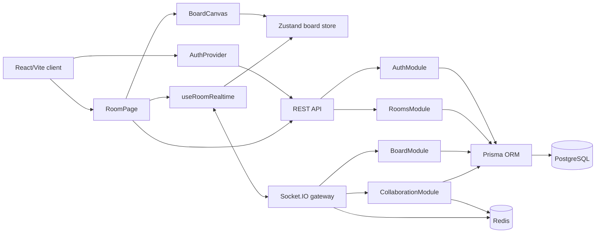

Thiết kế tách rõ dữ liệu bền vững và trạng thái live:

- PostgreSQL lưu users, sessions, rooms, memberships, board events, board snapshot, comments, text documents, version tags.
- Redis dùng cho Socket.IO adapter và state TTL như cursor, selection, text lease.
- Client chỉ render/queue intent; backend vẫn là nơi quyết định quyền và ghi mutation.

## 4. Stack và commands

| Layer | Công nghệ |
|---|---|
| Workspace | pnpm 11, TypeScript 5.9, ESLint 9 |
| Frontend | React 19, Vite 7, Tailwind CSS 4, React Router 7, React-Konva/Konva, Zustand, Socket.IO client, Yjs, Vitest |
| Backend | NestJS 11, Prisma 6, PostgreSQL, Socket.IO, Redis adapter, ioredis, Yjs, JWT, bcrypt, Jest |
| Dev services | Docker Compose: backend, postgres, redis |

| Command | Vai trò |
|---|---|
| `pnpm install` | Cài dependencies toàn workspace |
| `cp .env.example .env` | Tạo env host/local |
| `cp frontend/.env.example frontend/.env.local` | Trỏ Vite tới backend Docker `localhost:3001` |
| `docker compose up --build backend` | Chạy backend + PostgreSQL + Redis; backend tự chạy `prisma migrate deploy` |
| `pnpm dev:fe` | Chạy frontend ở `http://localhost:5173` |
| `pnpm dev:be` | Chạy backend local ngoài Docker |
| `pnpm lint` | ESLint toàn workspace |
| `pnpm test` | Backend Jest + frontend Vitest |
| `pnpm build` | Build toàn workspace |
| `pnpm --filter backend prisma:generate` | Regenerate Prisma client |

`frontend/src/config/env.ts` fallback về `http://localhost:3000` nếu thiếu `VITE_API_BASE_URL`; với setup hiện tại nên dùng `frontend/.env.local` để gọi `http://localhost:3001`.

## 5. Domain model và persistence


### 5.1 Bảng dữ liệu chính

| Model | Cột chính | Mục đích và thiết kế |
|---|---|---|
| `User` | `id`, `email`, `passwordHash`, `displayName`, `createdAt`, `updatedAt` | Tài khoản đăng nhập. `email` unique; `passwordHash` không trả về client. |
| `RefreshSession` | `id`, `userId`, `tokenHash`, `expiresAt`, `revokedAt`, `createdAt` | Refresh token rotation. Token raw client giữ là `sessionId.secret`; DB chỉ lưu `tokenHash`. |
| `Room` | `id`, `name`, `ownerId`, `inviteCode`, `createdAt`, `updatedAt` | Workspace cộng tác. `inviteCode` unique để join room. |
| `RoomMember` | `id`, `roomId`, `userId`, `role`, `createdAt`, `updatedAt` | Role theo room. Unique `(roomId, userId)`. |
| `BoardState` | `id`, `roomId`, `version`, `snapshotJson`, `updatedAt` | Snapshot hiện tại để client load/reconnect nhanh. |
| `BoardEvent` | `id`, `roomId`, `version`, `eventType`, `payloadJson`, `actorId`, `clientOpId`, `createdAt` | Append-only timeline. Unique `(roomId, version)` và `(roomId, clientOpId)`. |
| `VersionTag` | `id`, `roomId`, `version`, `label`, `createdAt` | Checkpoint label cho board version. Unique `(roomId, version, label)`. |
| `Comment` | `id`, `roomId`, `objectId`, `x`, `y`, `body`, `resolved`, `authorId`, `createdAt`, `updatedAt` | Room comment/annotation. Schema còn optional target fields, UI hiện chỉ tạo room-level comments. |
| `TextDocument` | `id`, `roomId`, `objectId`, `ydocBase64`, `text`, `updatedBy`, `updatedAt`, `createdAt` | Persist Yjs state và plain text cho text object. Unique `objectId`. |

### 5.2 Chi tiết RefreshSession và VersionTag

Repo không có bảng `RefreshToken`. Refresh token được quản lý bằng `RefreshSession`.

#### RefreshSession

| Column | Type | Constraint / ý nghĩa |
|---|---|---|
| `id` | `String` | Primary key, UUID; là phần `sessionId` trong refresh token. |
| `userId` | `String` | FK tới `User.id`, `onDelete: Cascade`, có index. |
| `tokenHash` | `String` | Bcrypt hash của refresh secret; không lưu token raw. |
| `expiresAt` | `DateTime` | Hết hạn theo `REFRESH_TOKEN_TTL_DAYS`. |
| `revokedAt` | `DateTime?` | `null` nếu còn hiệu lực; set khi refresh rotation/logout. |
| `createdAt` | `DateTime` | Default `now()`. |

#### VersionTag

| Column | Type | Constraint / ý nghĩa |
|---|---|---|
| `id` | `String` | Primary key, UUID. |
| `roomId` | `String` | FK tới `Room.id`, `onDelete: Cascade`, có index. |
| `version` | `Int` | Board version được gắn nhãn, có index. |
| `label` | `String` | Tên checkpoint user nhập. |
| `createdAt` | `DateTime` | Default `now()`. |

### 5.3 Thiết kế Comment hiện tại

Schema `Comment` vẫn hỗ trợ target optional:

- `objectId` cho object annotation.
- `x`, `y` cho canvas annotation/pin.
- `roomId` luôn có để phân vùng comment theo room.

Tuy nhiên UI hiện tại đã đơn giản hóa thành room-level comments:

- `RoomPage` có panel `Room Comments`.
- `handleCreateComment()` gọi `apiClient.createComment(activeRoom.id, { body }, token)`.
- Không còn `commentTarget` trong `RoomPage`; `BoardCanvas` vẫn còn prop comment tool/pins nhưng không được truyền từ `RoomPage` hiện tại.
- `CommentsService.create()` không còn bắt buộc phải có `objectId` hoặc `x/y`; comment chỉ cần `body`.
- `CommentsController.create()` broadcast realtime `comment:new` sau khi lưu DB.

Vì vậy `objectId/x/y` hiện là schema/API capability còn tồn tại, không phải luồng UI chính.

### 5.4 Board snapshot

```ts
type BoardSnapshot = {
  objects: Record<BoardObjectId, BoardObject>;
};
```

`BoardObject` có `id`, `roomId`, `type`, `x`, `y`, `rotation`, `version`, `createdBy`, `updatedBy`, timestamps, `props`, `metadata`, `deleted`. Delete là soft-delete.

| Type | Props chính |
|---|---|
| `rectangle` | `width`, `height`, `fill`, `stroke`, `strokeWidth` |
| `circle` | `radius`, `fill`, `stroke`, `strokeWidth` |
| `line` | `points`, `stroke`, `strokeWidth` |
| `text` | `text`, `width`, `fontSize`, `fill` |

### 5.5 Payload envelope

New `BoardEvent.payloadJson` lưu dạng:

```ts
{
  schemaVersion: 1,
  eventType: 'object:update',
  payload: { objectId, expectedVersion, patch }
}
```

`decodeBoardEventPayload()` vẫn đọc legacy raw payload. API/socket tiếp tục trả raw payload cho frontend.

### 5.6 Chiến lược lưu thay đổi nhỏ, thay đổi lớn và live state

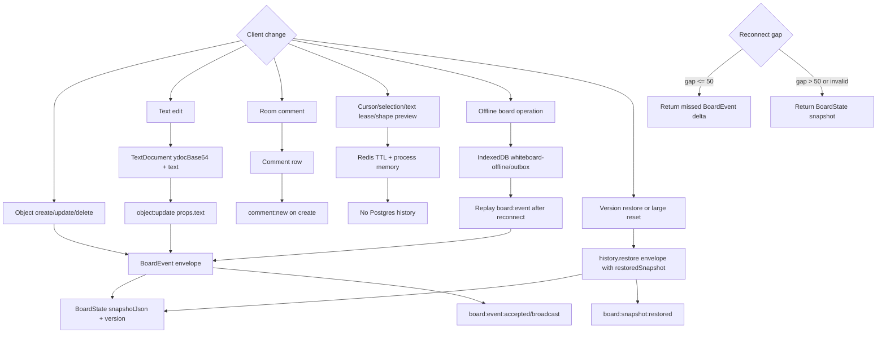

| Loại thay đổi | Cách lưu | Cách phát realtime | Ghi chú thiết kế |
|---|---|---|---|
| Object create/update/delete nhỏ | Append `BoardEvent` dạng envelope và cập nhật `BoardState.snapshotJson` | `board:event:accepted` cho sender, `board:event:broadcast` cho client khác | Event giữ audit trail; snapshot giúp load nhanh. |
| Text edit | Upsert `TextDocument` (`ydocBase64`, `text`) rồi ghi thêm `object:update props.text` | `text:yjs:accepted/broadcast` và board event tương ứng | Lease chặn hai user sửa cùng text object đồng thời; UI hiện commit whole-text. |
| Comment room-level | Insert/update/delete `Comment` row | Create broadcast `comment:new`; update/delete chưa có event realtime riêng | Schema còn optional `objectId/x/y`, nhưng RoomPage hiện chỉ tạo comment theo room. |
| Cursor/selection/lease/preview | Redis TTL + memory | Broadcast socket only | Trạng thái tạm thời, không replay sau reload. |
| Offline board operation | IndexedDB `whiteboard-offline/outbox` lưu request `board:event` | Replay khi socket join lại | Accepted thì remove; rejected thì mark `conflicted`. |
| Restore hoặc reset lớn | `history.restore` event chứa `restoredSnapshot`, cập nhật full `BoardState` | `board:snapshot:restored` | Client thay toàn bộ snapshot và clear undo/redo/selection/pending. |
| Reconnect nhiều thay đổi | Không ghi mới; đọc từ `BoardEvent` hoặc `BoardState` | `room:joined` trả delta/snapshot | Delta tối đa 50 events, quá ngưỡng trả snapshot. |

## 6. Backend design

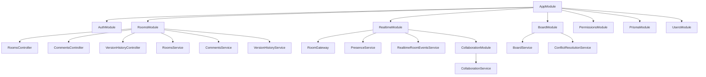

### 6.1 Auth

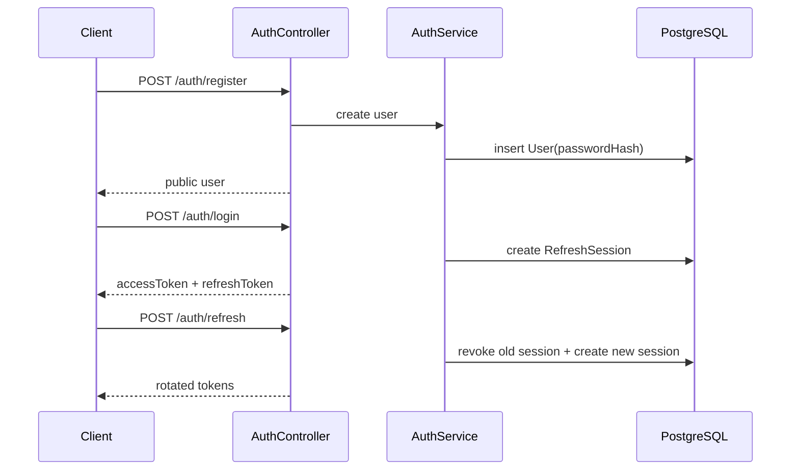

`register` không trả token; frontend login ngay sau register. Refresh token raw có dạng `sessionId.secret`, DB lưu bcrypt hash của secret. `JwtAuthGuard` verify Bearer access token và gắn public user vào request.

### 6.2 Roles và permission

```mermaid
flowchart LR
  Request --> JwtAuthGuard
  JwtAuthGuard --> RoomMemberGuard
  RoomMemberGuard --> Membership[(RoomMember)]
  RequiredRole[@RequiredRoomRole] --> RoomMemberGuard
  RoomMemberGuard --> Policy[canSatisfyRequiredRoomRole]
  Policy --> Handler[Controller handler]
```

| Role | View room | Edit board/tag | Manage room/member/restore |
|---|---:|---:|---:|
| `OWNER` | yes | yes | yes |
| `EDITOR` | yes | yes | no |
| `VIEWER` | yes | no | no |

Ownership transfer chưa implement; backend chặn owner tự đổi role hoặc tự remove.

### 6.3 Board event sourcing

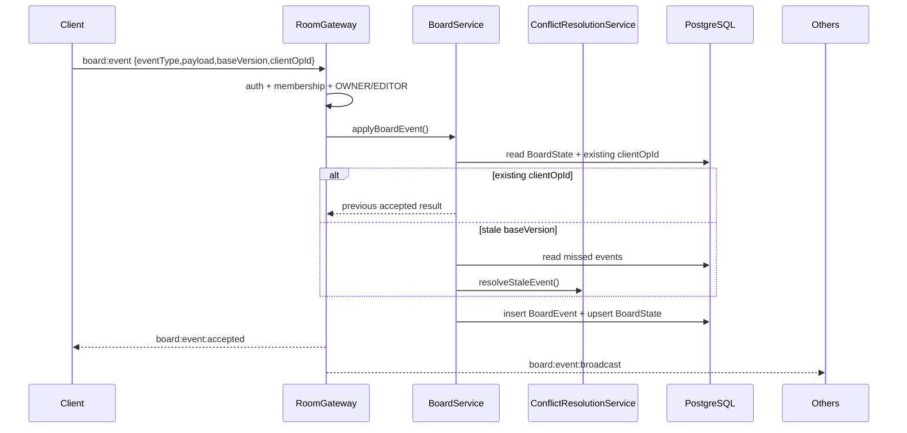

Thiết kế xử lý:

- `clientOpId` idempotency cho retry/offline replay.
- `baseVersion` kiểm version board client biết.
- `expectedVersion` kiểm object update/delete.
- Stale `object:update` auto-merge nếu missed events sửa field khác nhau; same-field conflict trả `VERSION_CONFLICT`.
- `object:delete` là soft-delete.

### 6.4 Conflict resolution

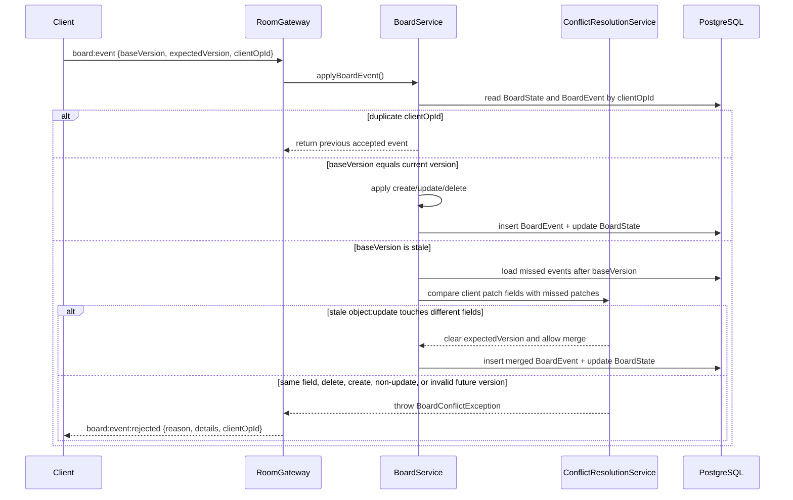

| Trường hợp | Kết quả | Dữ liệu trả về client |
|---|---|---|
| Retry cùng `clientOpId` | Idempotent accept; không ghi event mới | Accepted event/version cũ |
| `baseVersion` lớn hơn current | Reject | `VERSION_CONFLICT`, `conflictingFields: ['board.version']` |
| Stale `object:create` hoặc `object:delete` | Reject | Conflict theo `board.version` |
| Stale `object:update`, missed events chạm object khác | Merge | Event mới ghi trên snapshot current |
| Stale `object:update`, cùng object nhưng khác field | Merge | `expectedVersion` bị bỏ để patch áp vào object hiện tại |
| Stale `object:update`, cùng field | Reject | `conflictingFields`, `clientPatch`, `serverPatch`, `currentObject` |
| Object đã bị xóa | Reject | `conflictingFields: ['object.deleted']`, `currentObject` |
| Text object đang có lease của user khác | Reject ở gateway/collaboration layer | `text:lease:denied` hoặc board/text error |
| Offline replay bị reject | Giữ operation ở IndexedDB | `status: conflicted`, conflict drawer hiển thị để retry/discard |

Thiết kế này ưu tiên merge tự động cho patch nhỏ không đụng nhau, nhưng không cố đoán khi hai client sửa cùng field. Với text object, lớp text lease đứng trước board conflict để tránh hai editor cùng sửa một document trong phiên live.

### 6.5 Reconnect sync

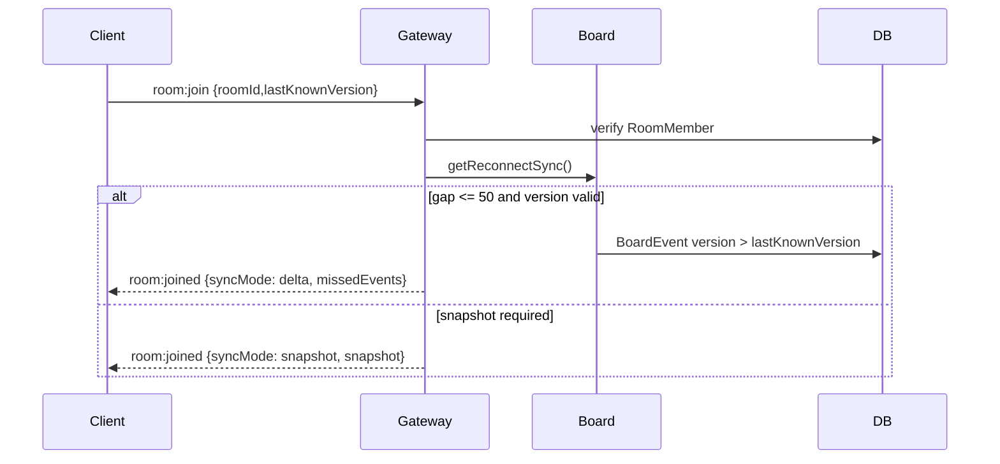

Ngưỡng delta hiện là 50 events.

### 6.6 Realtime collaboration

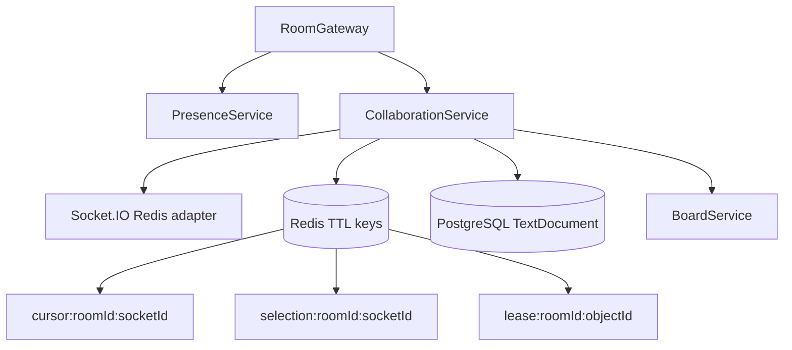

- Socket auth qua `handshake.auth.token` hoặc `Authorization`.
- Presence gom nhiều socket theo user trong process memory.
- Redis adapter được gắn nếu có `REDIS_URL`.
- Cursor TTL 10s, selection TTL 30s, text lease TTL 30s.
- Disconnect xóa cursor/selection/lease và broadcast remove/update.

### 6.7 Text editing

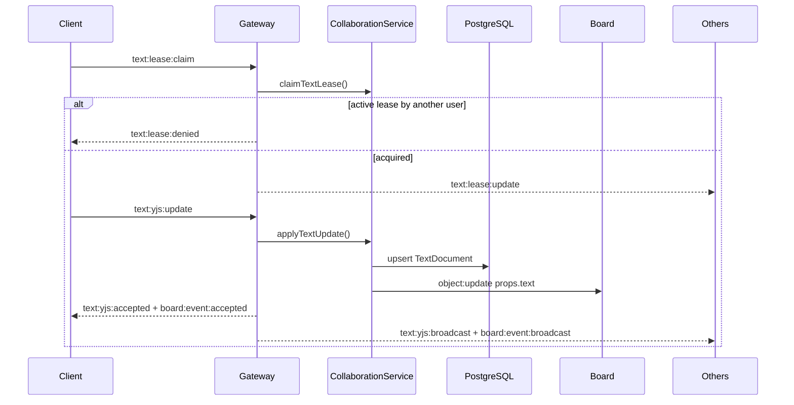

Backend persist Yjs state, nhưng UI hiện vẫn commit whole-text từ textarea; chưa phải editor CRDT per-character hoàn chỉnh.

### 6.8 Version restore

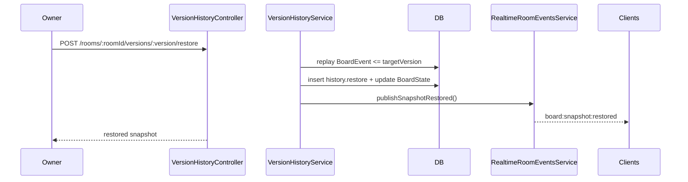

Client nhận restore sẽ thay snapshot, clear selection, pending history, undo/redo và optimistic markers.

## 7. Frontend design

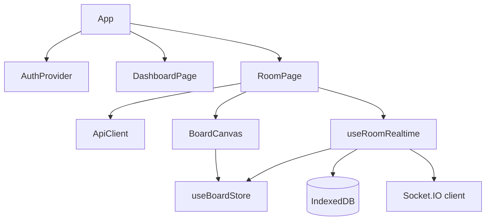

### 7.1 AuthProvider

- Refresh token lưu trong `sessionStorage` key `whiteboard.refreshToken`.
- App mount sẽ refresh session nếu có refresh token.
- `runWithAuth()` tự retry sau refresh nếu REST trả `401`.

### 7.2 Dashboard

- Health check `/health`.
- List/create/delete rooms.
- Join by invite code.
- Role badge và active/idle status theo `updatedAt`.

### 7.3 RoomPage

- Load room metadata + board snapshot bằng REST.
- Bật `useRoomRealtime` sau khi room ready.
- Presence/version panels đóng mặc định; comments panel mở mặc định.
- Comments hiện là room-level list/input.
- Conflict drawer hiện khi IndexedDB outbox có conflicted operation.
- Version restore dùng REST response làm fallback và socket event cho realtime.

### 7.4 BoardCanvas

| Capability | Implementation |
|---|---|
| Draw | Rectangle/circle/line local draft rồi commit `object:create` |
| Text create | Text tool mở input overlay rồi commit object text |
| Text edit | Double-click text, claim lease, emit Yjs update |
| Multi-select | Ctrl/Meta-click toggle; drag empty canvas tạo selection rect |
| Transform | Konva `Transformer`, drag/resize/rotate emit `object:update` |
| Delete | Delete/Backspace emit `object:delete` |
| Remote awareness | Cursor labels, remote selection boxes, text lease label |
| Comments leftovers | `BoardCanvas` vẫn có comment tool/pins props, nhưng `RoomPage` hiện không truyền comment pins/canvas target |
| Shortcuts | Ctrl+Z, Ctrl+Y/Ctrl+Shift+Z, Ctrl+0, Ctrl+/- |

## 8. API contracts

### 8.1 REST endpoints

| Method | Endpoint | Auth/Role | Purpose |
|---|---|---|---|
| `GET` | `/health` | public | Health check |
| `POST` | `/auth/register` | public | Create user |
| `POST` | `/auth/login` | public | Login tokens |
| `POST` | `/auth/refresh` | refresh token | Rotate tokens |
| `POST` | `/auth/logout` | refresh token | Revoke session |
| `GET` | `/auth/me` | JWT | Current user |
| `GET` | `/rooms` | JWT | List joined rooms |
| `POST` | `/rooms` | JWT | Create room |
| `POST` | `/rooms/join` | JWT | Join invite as viewer |
| `GET` | `/rooms/:roomId` | member | Room detail |
| `PATCH` | `/rooms/:roomId` | owner | Rename room |
| `DELETE` | `/rooms/:roomId` | owner | Delete room |
| `GET` | `/rooms/:roomId/board` | member | Board snapshot |
| `GET` | `/rooms/:roomId/members` | member | List members |
| `POST` | `/rooms/:roomId/members` | owner | Add member |
| `PATCH` | `/rooms/:roomId/members/:userId` | owner | Change role |
| `DELETE` | `/rooms/:roomId/members/:userId` | owner | Remove member |
| `GET` | `/rooms/:roomId/comments` | member | List comments |
| `POST` | `/rooms/:roomId/comments` | member | Create comment and broadcast `comment:new` |
| `PATCH` | `/rooms/:roomId/comments/:commentId` | author/owner | Edit body/resolved |
| `DELETE` | `/rooms/:roomId/comments/:commentId` | author/owner | Delete comment |
| `GET` | `/rooms/:roomId/versions` | member | Recent 50 events + tags |
| `POST` | `/rooms/:roomId/versions/tags` | owner/editor | Tag version |
| `GET` | `/rooms/:roomId/versions/:version` | member | Version detail |
| `POST` | `/rooms/:roomId/versions/:version/restore` | owner | Restore snapshot |

### 8.2 Socket.IO events

| Event | Direction | Purpose |
|---|---|---|
| `room:join` | client -> server | Join room channel with `lastKnownVersion` |
| `room:joined` | server -> client | Role, presence, delta/snapshot |
| `room:error` | server -> client | App-level socket error |
| `presence:update` | server -> room | Online users |
| `board:event` | client -> server | Board create/update/delete |
| `board:event:accepted` | server -> sender | Persisted board event |
| `board:event:broadcast` | server -> others | Remote board event |
| `board:event:rejected` | server -> sender | Validation/permission/conflict |
| `board:snapshot:restored` | server -> room | Restore snapshot |
| `cursor:update` | client -> server | Live cursor |
| `cursor:broadcast` | server -> others | Remote cursor |
| `cursor:remove` | server -> room | Remove cursor |
| `selection:update` | client -> server | Selected/editing object ids |
| `selection:broadcast` | server -> others | Remote selection |
| `selection:remove` | server -> room | Remove selection |
| `text:lease:claim` | client -> server | Claim text lease |
| `text:lease:release` | client -> server | Release text lease |
| `text:lease:update` | server -> room | Lease state |
| `text:lease:denied` | server -> sender | Lease conflict |
| `text:yjs:update` | client -> server | Text Yjs update |
| `text:yjs:accepted` | server -> sender | Text accepted |
| `text:yjs:broadcast` | server -> others | Remote text update |
| `comment:new` | server -> room, client -> server supported | Realtime new room comment |
| `shape:preview` | client -> room | Ephemeral transform preview |

`comment:new` đang được gateway/client dùng nhưng chưa có trong `SocketEventName` của shared package.

## 9. Core workflows

### 9.1 Room open

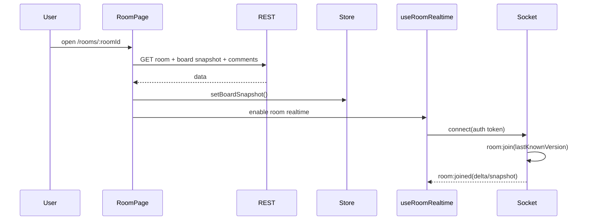

### 9.2 Optimistic create and offline queue

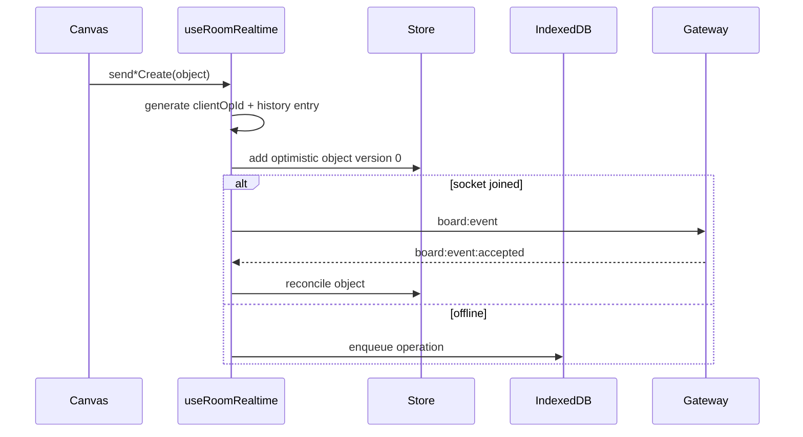

### 9.3 Offline conflict

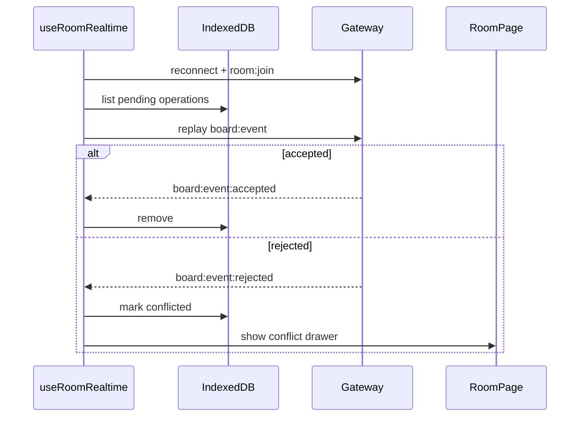

### 9.4 Room comments realtime

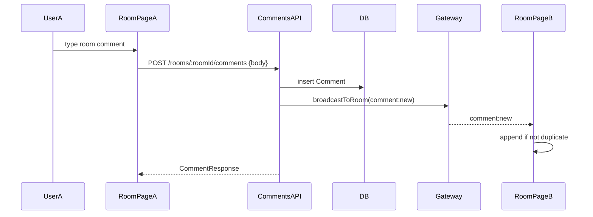

Creator also updates local list from REST response; `onCommentReceived` de-dupes by comment id.

### 9.5 Restore

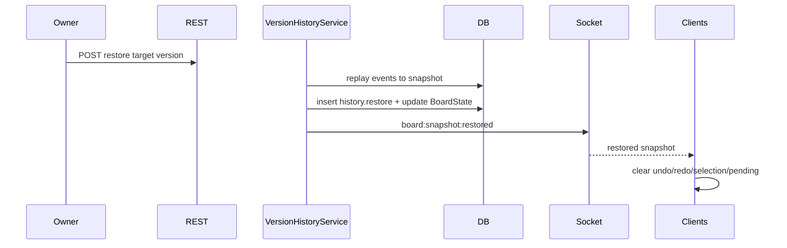

## 10. Operations and configuration

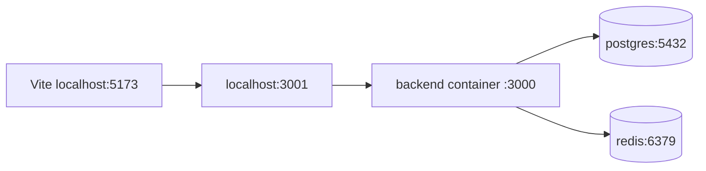

| Service | Host port | Container port |
|---|---:|---:|
| Frontend Vite | `5173` | local process |
| Backend | `3001` | `3000` |
| PostgreSQL | `5432` | `5432` |
| Redis | `6380` | `6379` |

Important env vars: `DATABASE_URL`, `REDIS_URL`, `BACKEND_PORT`, `POSTGRES_*`, `REDIS_PORT`, `CORS_ORIGIN`, `VITE_API_BASE_URL`, `JWT_ACCESS_SECRET`, `JWT_ACCESS_TTL`, `REFRESH_TOKEN_TTL_DAYS`.

Backend Dockerfile runs `prisma generate`, `nest build`, then starts with `prisma migrate deploy && node dist/main.js`.

## 11. Testing

| Area | Files | Coverage focus |
|---|---|---|
| Auth | `backend/src/auth/auth.controller.spec.ts` | Register, login, refresh, logout, `/auth/me` |
| Board | `backend/src/board/board.service.spec.ts` | Events, snapshot, reconnect sync, conflicts |
| Permissions | `backend/src/permissions/room-permissions.spec.ts` | Role helpers |
| Realtime | `backend/src/realtime/room.gateway.spec.ts` | Socket auth/join/presence/board/text lease |
| Presence | `backend/src/realtime/presence.service.spec.ts` | Multi-socket presence |
| Rooms | `backend/src/rooms/rooms.controller.spec.ts` | Room/member APIs |
| Versions | `backend/src/rooms/version-history.controller.spec.ts` | Version/tag/detail APIs |
| Board frontend | `frontend/src/board/*.test.ts` | Store and canvas helpers |
| Realtime frontend | `frontend/src/realtime/useRoomRealtime.test.ts` | Helpers and conflict formatting |
| Versions frontend | `frontend/src/versions/versionHistory.test.ts` | Display helpers |

Gaps: no automated browser E2E in package scripts, no dedicated comments controller/service spec, and no multi-client browser test for `comment:new`/restore/offline replay.

## 12. Feature status matrix

| Feature | Status | Notes |
|---|---|---|
| Auth + refresh rotation | Complete | `RefreshSession` stores token hash |
| Room CRUD + invite join | Complete | Invite join creates viewer |
| Role-based permissions | Complete | REST + socket enforce roles |
| Board event sourcing | Complete | Snapshot + append-only log |
| Small change persistence | Complete | Board deltas stored as `BoardEvent` envelope and folded into `BoardState` |
| Large reset persistence | Complete | Restore writes `history.restore` and broadcasts full snapshot |
| Reconnect sync | Complete | Delta if <= 50 events |
| Multi-cursor | Complete live state | TTL state, no history |
| Remote selection | Complete live state | selected/editing modes |
| Soft text lock | Complete | TTL lease, backend conflict |
| Yjs text persistence | Implemented | UI still whole-text textarea |
| Room comments realtime | Implemented | REST create broadcasts `comment:new` |
| Object/canvas comment target | Schema/API supported | UI currently does not create targeted comments |
| Offline outbox | Functional | IndexedDB pending/conflicted |
| Conflict resolution | Functional for object update | Field-level merge for stale update |
| Undo/redo | Functional client-side | ACK matched by `clientOpId` |
| Restore version | Complete | Emits `board:snapshot:restored` |
| Redis adapter | Implemented | Used when `REDIS_URL` exists |

## 13. Known limitations and next work

1. Add `comment:new` to `SocketEventName` in `packages/shared/src/index.ts` so shared contract matches gateway/client.
2. Decide whether comments should remain room-level only or revive object/canvas annotation UI. Schema supports targets, but current RoomPage does not use them.
3. Add realtime events for comment update/delete if resolved/delete should sync immediately across clients.
4. Add browser E2E for multi-client board sync, comments, restore, cursor/selection, offline replay.
5. Implement ownership transfer before allowing owner self-role-change/self-remove.
6. Deepen collaborative text UI if true per-character Yjs editing is required.
7. Harden production: rate limits, structured logs, metrics, tracing, readiness checks, stricter CORS/secret validation.

## 14. Diagram coverage map

| Chủ đề | Đã có hình vẽ ở mục | Còn thiếu |
|---|---|---|
| Runtime tổng thể | 3 | Không |
| Domain model / database | 5 | Không |
| Lưu thay đổi nhỏ/lớn/live/offline | 5.6 | Không |
| Backend module graph | 6 | Không |
| Auth + refresh rotation | 6.1 | Không |
| Role guard / permission | 6.2 | Không |
| Board event sourcing | 6.3 | Không |
| Conflict resolution | 6.4 | Không |
| Reconnect delta/snapshot | 6.5 | Không |
| Redis-backed collaboration state | 6.6 | Không |
| Text lease + Yjs persistence | 6.7 | Không |
| Version restore realtime | 6.8 và 9.5 | Không |
| Frontend component/data flow | 7 | Không |
| Room open workflow | 9.1 | Không |
| Optimistic create/offline queue | 9.2 | Không |
| Offline conflict handling | 9.3 | Không |
| Room comments realtime | 9.4 | Không |
| Docker/local runtime | 10 | Không |

Với trạng thái code hiện tại, report đã có sơ đồ cho các tính năng chính và các cơ chế quan trọng. Những phần không có sơ đồ riêng là các bảng API/test/status vì trình bày bằng bảng rõ hơn sơ đồ.

## 15. Source-of-truth notes

- `README.md` and `AGENTS.md` describe Docker backend + local frontend flow.
- `CLAUDE.md` may contain older notes and should not be treated as current source of truth.
- `frontend/.env.local` should set `VITE_API_BASE_URL=http://localhost:3001`.
