# Báo cáo chi tiết repository: Real-Time Collaborative Tactical Whiteboard

## 1. Tóm tắt hiện trạng

Repository là một pnpm monorepo cho whiteboard cộng tác thời gian thực. Hệ thống gồm:

- Frontend React 19 + Vite + TypeScript, render canvas bằng React-Konva, quản lý state bằng Zustand.
- Backend NestJS 11 + Prisma + PostgreSQL, cung cấp REST API, Socket.IO realtime, auth JWT và event-sourced board state.
- Shared package `@whiteboard/shared`, chứa type contract tối thiểu dùng chung giữa frontend/backend.
- Docker Compose cho local dev backend stack: backend container + PostgreSQL + Redis. Frontend vẫn chạy local để Vite reload nhanh.

Các tính năng đã có end-to-end: auth, room/member/role, board create/update/delete, realtime broadcast, reconnect delta/snapshot sync, live cursor, remote selection, soft text lease, Yjs text persistence, comments/annotations, version history, restore realtime, offline outbox và conflict drawer cơ bản.

Các giới hạn còn đáng lưu ý: comments chưa broadcast realtime riêng, ownership transfer chưa implement, text editing vẫn là whole-text patch trên nền Yjs state thay vì editor CRDT per-character đầy đủ, và test E2E nhiều trình duyệt/nhiều client chưa có trong package scripts.

## 2. Cấu trúc repository

```text
.
├── backend/
│   ├── Dockerfile
│   ├── prisma/
│   │   ├── schema.prisma
│   │   └── migrations/
│   └── src/
│       ├── auth/             # register/login/refresh/logout/JWT guard
│       ├── board/            # event sourcing, payload codec, conflict resolution
│       ├── collaboration/    # Redis adapter, cursor/selection/text lease, Yjs text state
│       ├── permissions/      # room role policy + guard
│       ├── prisma/           # PrismaService
│       ├── realtime/         # Socket.IO gateway, presence, restore publisher
│       ├── rooms/            # room CRUD, members, comments, versions
│       └── users/            # user lookup/public projection
├── frontend/
│   └── src/
│       ├── api/              # typed REST client
│       ├── auth/             # AuthProvider, route guards, session storage
│       ├── board/            # Zustand board store + Konva canvas
│       ├── components/       # panels, badges, UI primitives
│       ├── config/           # Vite env mapping
│       ├── pages/            # Dashboard, Room, Login, Register
│       ├── realtime/         # Socket.IO hook + IndexedDB offline outbox
│       └── versions/         # version-history display helpers
├── packages/shared/src/      # shared TypeScript contracts
├── docker-compose.yml        # backend + postgres + redis
├── AGENTS.md                 # contributor guide
└── README.md                 # quickstart
```

`backend/dist/`, `frontend/dist/`, `node_modules/`, `.env`, and `frontend/.env.local` are generated/local artifacts and should not be treated as source of truth.

## 3. Runtime architecture

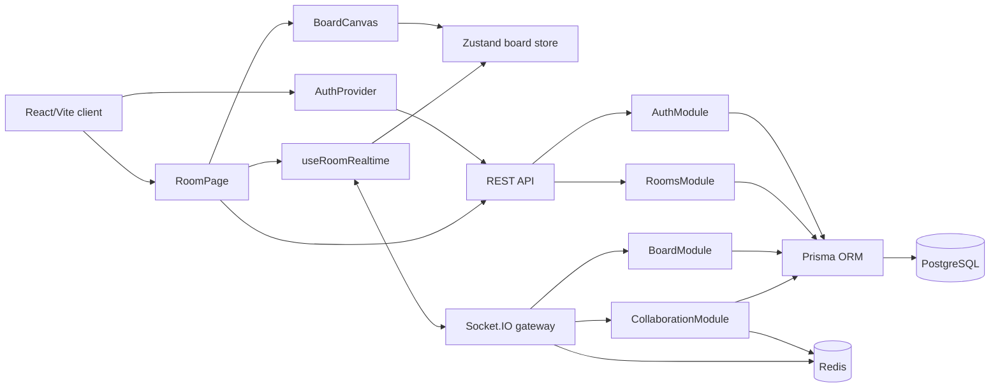

Thiết kế này tách dữ liệu bền vững khỏi trạng thái cộng tác tạm thời:

- PostgreSQL là nguồn sự thật cho users, sessions, rooms, memberships, board events, board snapshot, comments, text documents và version tags.
- Redis dùng cho Socket.IO adapter và trạng thái TTL như cursor, object selection, text lease. Restart Redis có thể làm mất trạng thái live tạm thời nhưng không mất dữ liệu board.
- Client không tự quyết định quyền; REST guard và Socket gateway đều kiểm tra membership/role.

## 4. Stack và commands

| Layer | Công nghệ |
|---|---|
| Workspace | pnpm 11, TypeScript 5.9, ESLint 9 |
| Frontend | React 19, Vite 7, Tailwind CSS 4, React Router 7, React-Konva/Konva, Zustand, Socket.IO client, Yjs, Vitest |
| Backend | NestJS 11, Prisma 6, PostgreSQL, Socket.IO, Redis adapter, ioredis, Yjs, JWT, bcrypt, Jest |
| Dev services | Docker Compose: backend, postgres, redis |

Các command chính chạy từ repo root:

| Command | Vai trò |
|---|---|
| `pnpm install` | Cài dependencies toàn workspace |
| `cp .env.example .env` | Tạo env host/local |
| `cp frontend/.env.example frontend/.env.local` | Trỏ Vite tới backend Docker `localhost:3001` |
| `docker compose up --build backend` | Chạy backend + Postgres + Redis; backend tự chạy `prisma migrate deploy` |
| `pnpm dev:fe` | Chạy frontend ở `http://localhost:5173` |
| `pnpm dev:be` | Chạy backend local ngoài Docker |
| `pnpm lint` | ESLint toàn workspace |
| `pnpm test` | Backend Jest + frontend Vitest |
| `pnpm build` | Build tất cả packages |
| `pnpm --filter backend prisma:generate` | Regenerate Prisma client sau khi đổi schema |

Lưu ý: `frontend/src/config/env.ts` fallback về `http://localhost:3000` nếu thiếu `VITE_API_BASE_URL`. Với setup hiện tại nên luôn dùng `frontend/.env.local` để frontend gọi `http://localhost:3001`.

## 5. Domain model và persistence

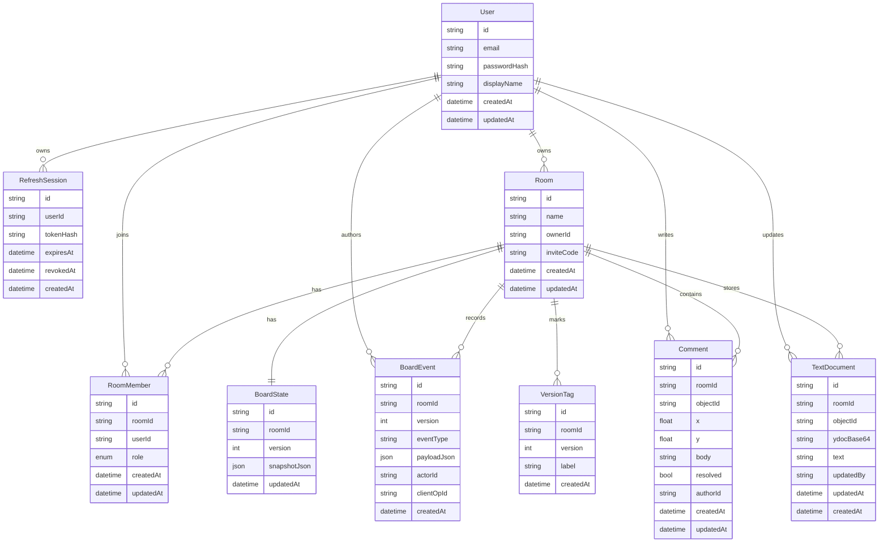

### 5.1 Bảng dữ liệu chính

| Model | Cột chính | Mục đích và thiết kế |
|---|---|---|
| `User` | `id`, `email`, `passwordHash`, `displayName`, `createdAt`, `updatedAt` | Tài khoản đăng nhập. `email` unique; `passwordHash` không trả về client. |
| `RefreshSession` | `id`, `userId`, `tokenHash`, `expiresAt`, `revokedAt`, `createdAt` | Refresh token rotation. Refresh token gửi cho client có dạng `sessionId.secret`; DB chỉ lưu `tokenHash`. `revokedAt` dùng để vô hiệu hóa session cũ sau refresh/logout. |
| `Room` | `id`, `name`, `ownerId`, `inviteCode`, `createdAt`, `updatedAt` | Workspace cộng tác. `inviteCode` unique để join room; delete room cascade tới membership/board/comment/text state. |
| `RoomMember` | `id`, `roomId`, `userId`, `role`, `createdAt`, `updatedAt` | Role theo room. Unique `(roomId, userId)`; role `OWNER`, `EDITOR`, `VIEWER`. |
| `BoardState` | `id`, `roomId`, `version`, `snapshotJson`, `updatedAt` | Snapshot hiện tại. `version` tăng tuần tự để client sync/reconnect mà không replay toàn bộ event mỗi lần. |
| `BoardEvent` | `id`, `roomId`, `version`, `eventType`, `payloadJson`, `actorId`, `clientOpId`, `createdAt` | Append-only event log. Unique `(roomId, version)` cho timeline; unique `(roomId, clientOpId)` cho idempotent retry/offline replay. |
| `VersionTag` | `id`, `roomId`, `version`, `label`, `createdAt` | Checkpoint label cho version. Unique `(roomId, version, label)` để cùng một version có nhiều nhãn nhưng không trùng label. |
| `Comment` | `id`, `roomId`, `objectId`, `x`, `y`, `body`, `resolved`, `authorId`, `createdAt`, `updatedAt` | Annotation trong room. `objectId` dùng cho object annotation; `x/y` dùng cho canvas annotation/pin. Backend yêu cầu có `objectId` hoặc đủ cặp tọa độ `x/y`. |
| `TextDocument` | `id`, `roomId`, `objectId`, `ydocBase64`, `text`, `updatedBy`, `updatedAt`, `createdAt` | Yjs text persistence. Unique `objectId`; lưu cả Yjs update state và plain text. |

### 5.2 Chi tiết RefreshSession và VersionTag

Repo hiện tại không có bảng tên `RefreshToken`. Refresh token được quản lý bằng bảng `RefreshSession`; token raw gửi về client có dạng `sessionId.secret`, còn database chỉ lưu hash của `secret`.

#### RefreshSession

| Column | Type | Constraint / ý nghĩa |
|---|---|---|
| `id` | `String` | Primary key, UUID; cũng là phần `sessionId` trong refresh token client giữ. |
| `userId` | `String` | Foreign key tới `User.id`, `onDelete: Cascade`; index riêng để tìm session theo user. |
| `tokenHash` | `String` | Bcrypt hash của refresh secret; không lưu refresh token raw. |
| `expiresAt` | `DateTime` | Thời điểm session hết hạn, tính theo `REFRESH_TOKEN_TTL_DAYS`. |
| `revokedAt` | `DateTime?` | `null` nếu còn hiệu lực; set khi refresh rotation hoặc logout. |
| `createdAt` | `DateTime` | Default `now()`. |

Luồng sử dụng: login tạo một `RefreshSession`; refresh verify `sessionId.secret`, revoke session cũ bằng `revokedAt`, rồi tạo session mới; logout cũng set `revokedAt`.

#### VersionTag

| Column | Type | Constraint / ý nghĩa |
|---|---|---|
| `id` | `String` | Primary key, UUID. |
| `roomId` | `String` | Foreign key tới `Room.id`, `onDelete: Cascade`; index riêng để list tag theo room. |
| `version` | `Int` | Board version được gắn nhãn; index riêng để tìm tag theo version. |
| `label` | `String` | Tên checkpoint do user nhập, ví dụ `Kickoff layout`. |
| `createdAt` | `DateTime` | Default `now()`. |

Constraint quan trọng: `@@unique([roomId, version, label])`, nghĩa là cùng một room/version có thể có nhiều label khác nhau, nhưng không được trùng cùng label.

### 5.3 Thiết kế Comment

`Comment` không chỉ là comment cấp room dạng danh sách phẳng. Thiết kế hiện tại là room-scoped annotation có target tùy chọn:

- `roomId` luôn có để phân vùng comment theo room.
- `objectId` dùng khi user comment object đang chọn.
- `x` và `y` dùng khi user chọn comment tool rồi pin annotation trực tiếp lên canvas.
- `body`, `resolved`, `authorId`, timestamps dùng cho nội dung, trạng thái và quyền sửa/xóa.

Frontend đang dùng cả hai kiểu target: `RoomPage` gửi `{ objectId, body }` cho “Comment selected” và gửi `{ x, y, body }` khi click comment tool trên canvas. `commentPins` render pin theo `x/y`; nếu comment gắn object thì pin lấy tọa độ hiện tại của object.

### 5.4 Board snapshot

Board state trong DB là object map:

```ts
type BoardSnapshot = {
  objects: Record<BoardObjectId, BoardObject>;
};
```

`BoardObject` có `id`, `roomId`, `type`, `x`, `y`, `rotation`, `version`, `createdBy`, `updatedBy`, timestamps, `props`, `metadata`, `deleted`. Object delete là soft-delete để event replay và undo có thể giữ ngữ cảnh.

Các object type hiện có:

| Type | Props chính |
|---|---|
| `rectangle` | `width`, `height`, `fill`, `stroke`, `strokeWidth` |
| `circle` | `radius`, `fill`, `stroke`, `strokeWidth` |
| `line` | `points`, `stroke`, `strokeWidth` |
| `text` | `text`, `width`, `fontSize`, `fill` |

### 5.5 Payload envelope

New board events lưu payload theo envelope:

```ts
{
  schemaVersion: 1,
  eventType: 'object:update',
  payload: { objectId, expectedVersion, patch }
}
```

`decodeBoardEventPayload()` vẫn đọc được legacy raw payload. Nhờ vậy DB có dấu hiệu schema version cho audit/replay tương lai, còn REST/Socket vẫn trả raw payload cho frontend để không đổi client contract.

## 6. Backend design

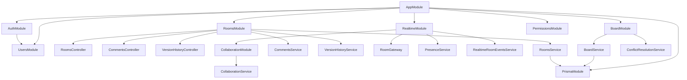

### 6.1 Auth

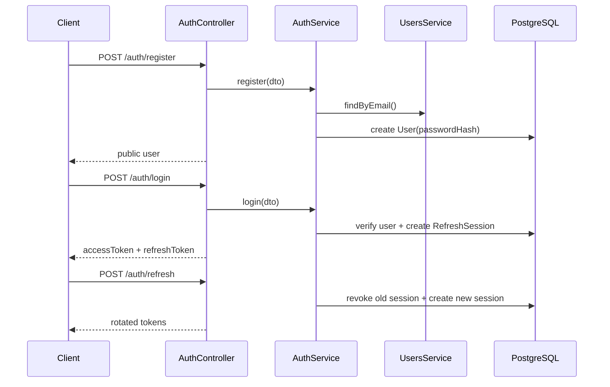

Auth xử lý:

- `register` chỉ tạo user và trả public user; frontend tự login sau register.
- Access token là JWT có `sub`, `email`; backend dùng `JWT_ACCESS_SECRET`.
- Refresh token format là `sessionId.secret`; DB chỉ lưu bcrypt hash của secret.
- Refresh token rotation revoke session cũ và tạo session mới.
- `JwtAuthGuard` đọc Bearer token, verify JWT, rồi gắn public user vào request.

### 6.2 Rooms, roles và permissions

```mermaid
flowchart LR
  Request[REST request] --> JwtAuthGuard
  JwtAuthGuard --> RoomMemberGuard
  RoomMemberGuard --> Membership[(RoomMember)]
  RequiredRole[@RequiredRoomRole]
  RequiredRole --> RoomMemberGuard
  RoomMemberGuard --> Policy[canSatisfyRequiredRoomRole]
  Policy --> Controller[Controller handler]
```

Role policy tập trung ở `room-permissions.ts`:

| Role | View room | Edit board/tag | Manage room/member/restore |
|---|---:|---:|---:|
| `OWNER` | yes | yes | yes |
| `EDITOR` | yes | yes | no |
| `VIEWER` | yes | no | no |

Room design xử lý:

- Tạo room chạy transaction: tạo `Room`, owner membership, `BoardState` version `0`.
- Join bằng invite code tạo membership `VIEWER`.
- Owner có thể đổi tên/xóa room, thêm/xóa member, đổi role member.
- Owner không thể tự hạ role hoặc tự remove vì ownership transfer chưa implement.
- `RoomMemberGuard` lấy `roomId` từ params/body/query, kiểm membership và required role.

### 6.3 Board event sourcing

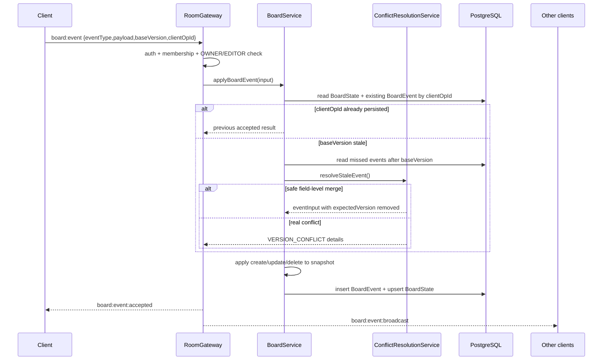

Board design xử lý:

- Server-authoritative mutations: client chỉ gửi intent.
- `BoardEvent.version` là timeline của room; `BoardState.version` là snapshot version hiện tại.
- `clientOpId` chống ghi trùng khi offline replay hoặc retry.
- `baseVersion` bắt client khai báo version board đang biết.
- `expectedVersion` bảo vệ update/delete object cụ thể.
- Stale `object:update` có thể auto-merge nếu missed events sửa field khác; cùng field sẽ reject với `details.conflictingFields`.
- `object:create` conflict nếu object id đang tồn tại và chưa deleted.
- `object:delete` là soft-delete.

Board event types hiện hỗ trợ:

| Event | Payload | Ghi chú |
|---|---|---|
| `object:create` | `{ object: { id,type,x,y,rotation?,props?,metadata? } }` | Object version bắt đầu `1` |
| `object:update` | `{ objectId, expectedVersion?, patch }` | Patch merge `props`/`metadata`, tăng object version |
| `object:delete` | `{ objectId, expectedVersion? }` | Soft-delete, tăng object version |
| `history.restore` | Internal version event | Ghi bởi restore service, không phải client board event |

### 6.4 Reconnect sync

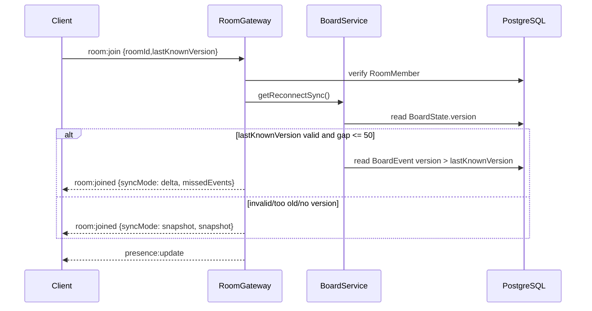

Mục tiêu là tránh reload snapshot lớn khi client chỉ lỡ vài event gần đây. Ngưỡng delta hiện là 50 events.

### 6.5 Realtime collaboration

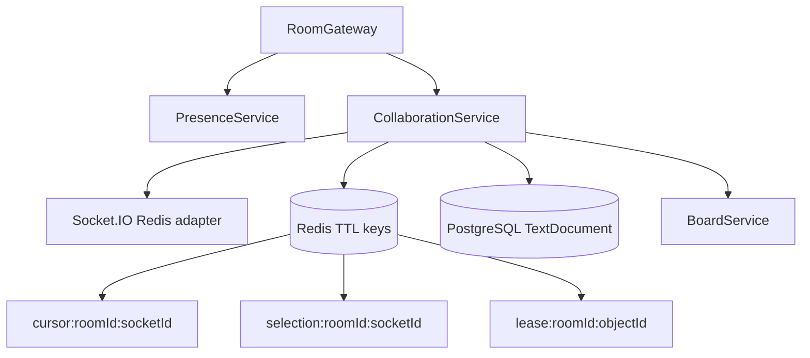

Collaboration design xử lý:

- Socket authentication qua `handshake.auth.token` hoặc `Authorization` header.
- `PresenceService` gom nhiều socket của cùng user thành một presence record trong process.
- `CollaborationService.attachSocketAdapter()` gắn Redis adapter nếu có `REDIS_URL`.
- Cursor TTL 10 giây, selection TTL 30 giây, text lease TTL 30 giây.
- Disconnect xóa cursor, selection, text lease của socket và broadcast remove/update event.

### 6.6 Text editing

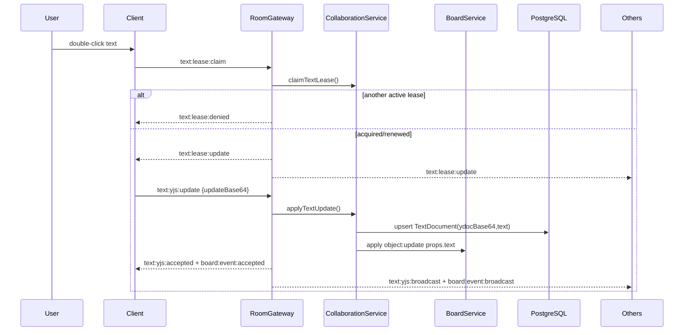

Soft lease xử lý tranh chấp edit text ở mức UX và backend guard. Yjs state được persist, nhưng UI hiện vẫn commit toàn text qua textarea; chưa phải editor CRDT multi-cursor per-character hoàn chỉnh.

### 6.7 Version history và restore

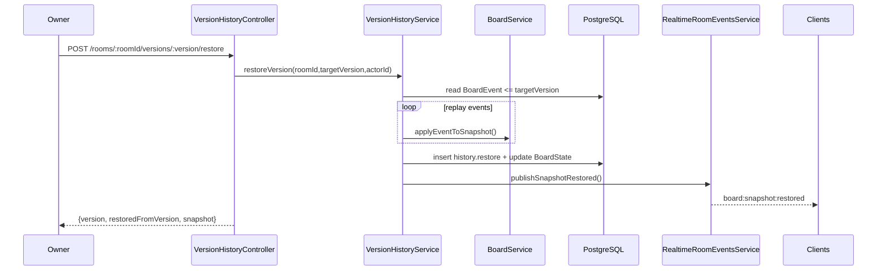

Restore là reset cấp room. Client nhận `board:snapshot:restored` sẽ thay snapshot local, clear selection, clear optimistic create markers, clear pending history, undo stack và redo stack.

## 7. Frontend design

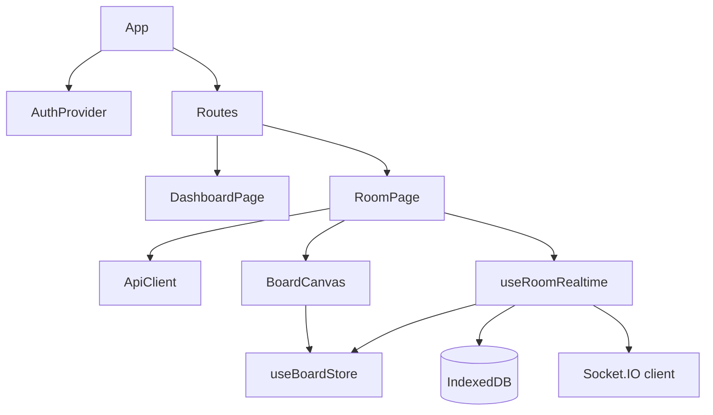

### 7.1 AuthProvider

Frontend session design:

- Refresh token lưu trong `sessionStorage` key `whiteboard.refreshToken`.
- `AuthProvider` refresh session khi app mount.
- `runWithAuth()` tự refresh access token nếu REST request trả `401`.
- `RequireAuth` bảo vệ `/dashboard` và `/rooms/:roomId`.
- `RedirectIfAuthenticated` tránh user đã login vào login/register.

### 7.2 Dashboard

Dashboard xử lý:

- Health check `/health`.
- List rooms user tham gia.
- Create room và optimistic insert room vào list sau success.
- Join room bằng invite code.
- Delete room nếu user có quyền owner.
- Hiển thị role badge và trạng thái active/idle dựa trên `updatedAt`.

### 7.3 RoomPage

RoomPage là composition root cho board:

- Load room metadata và board snapshot bằng REST trước.
- Khởi động `useRoomRealtime` sau khi room ready.
- Panels users/members, comments, versions mặc định đóng.
- Object detail panel hiện khi exactly one object selected.
- Comments panel tạo comment theo object hoặc tọa độ canvas.
- Conflict drawer hiện khi IndexedDB outbox có operation `conflicted`.
- Version restore dùng REST response làm fallback và socket event làm realtime update cho mọi client.

### 7.4 BoardCanvas

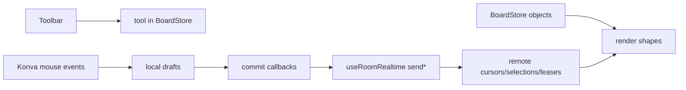

Canvas behavior:

| Capability | Implementation |
|---|---|
| Draw | Rectangle, circle, line use local draft then commit `object:create` |
| Text create | Text tool opens HTML input overlay then commits `object:create` |
| Text edit | Double click text, claim lease, commit Yjs update |
| Multi-select | Ctrl/Meta-click toggles selection; dragging empty canvas creates selection rect |
| Transform | Konva `Transformer`, drag/resize/rotate emits `object:update` |
| Delete | Delete/Backspace emits `object:delete` for selected objects |
| Remote awareness | Live cursor labels, remote selection boxes, text lease label |
| Comments | Open comment target on canvas point; render unresolved comment pins |
| Shortcuts | Ctrl+Z, Ctrl+Y/Ctrl+Shift+Z, Ctrl+0, Ctrl+/- |

## 8. API contracts

### 8.1 REST endpoints

| Method | Endpoint | Auth/Role | Purpose |
|---|---|---|---|
| `GET` | `/health` | public | Service health |
| `POST` | `/auth/register` | public | Create user, returns public user |
| `POST` | `/auth/login` | public | Create access + refresh token |
| `POST` | `/auth/refresh` | refresh token | Rotate refresh token |
| `POST` | `/auth/logout` | refresh token | Revoke refresh session |
| `GET` | `/auth/me` | JWT | Current public user |
| `GET` | `/rooms` | JWT | Rooms current user joined |
| `POST` | `/rooms` | JWT | Create room, owner membership, empty board |
| `POST` | `/rooms/join` | JWT | Join by invite code as viewer |
| `GET` | `/rooms/:roomId` | member | Room detail |
| `PATCH` | `/rooms/:roomId` | owner | Rename room |
| `DELETE` | `/rooms/:roomId` | owner | Delete room |
| `GET` | `/rooms/:roomId/board` | member | Current board snapshot |
| `GET` | `/rooms/:roomId/members` | member | List members |
| `POST` | `/rooms/:roomId/members` | owner | Add member by userId |
| `PATCH` | `/rooms/:roomId/members/:userId` | owner | Change member role |
| `DELETE` | `/rooms/:roomId/members/:userId` | owner | Remove member |
| `GET` | `/rooms/:roomId/comments` | member | List annotations |
| `POST` | `/rooms/:roomId/comments` | member | Create object/canvas annotation |
| `PATCH` | `/rooms/:roomId/comments/:commentId` | author/owner | Edit body or resolved state |
| `DELETE` | `/rooms/:roomId/comments/:commentId` | author/owner | Delete comment |
| `GET` | `/rooms/:roomId/versions` | member | Recent 50 events + tags |
| `POST` | `/rooms/:roomId/versions/tags` | owner/editor | Tag a version |
| `GET` | `/rooms/:roomId/versions/:version` | member | Version detail |
| `POST` | `/rooms/:roomId/versions/:version/restore` | owner | Restore board snapshot |

### 8.2 Socket.IO events

| Event | Direction | Purpose |
|---|---|---|
| `room:join` | client -> server | Join room channel with `lastKnownVersion` |
| `room:joined` | server -> client | Role, presence and delta/snapshot sync |
| `room:error` | server -> client | App-level socket error |
| `presence:update` | server -> room | Online users per room |
| `board:event` | client -> server | Create/update/delete board event |
| `board:event:accepted` | server -> sender | Persisted event with version/clientOpId |
| `board:event:broadcast` | server -> other clients | Persisted event from someone else |
| `board:event:rejected` | server -> sender | Validation/permission/conflict rejection |
| `board:snapshot:restored` | server -> room | Restore has replaced room snapshot |
| `cursor:update` | client -> server | Live cursor position |
| `cursor:broadcast` | server -> other clients | Remote cursor |
| `cursor:remove` | server -> room | Remove stale/disconnected cursor |
| `selection:update` | client -> server | Selected/editing object ids |
| `selection:broadcast` | server -> other clients | Remote selection/editing state |
| `selection:remove` | server -> room | Remove stale/disconnected selection |
| `text:lease:claim` | client -> server | Claim/renew text edit lease |
| `text:lease:release` | client -> server | Release text edit lease |
| `text:lease:update` | server -> room | Lease current state or release |
| `text:lease:denied` | server -> sender | Another user owns active lease |
| `text:yjs:update` | client -> server | Persist text Yjs update |
| `text:yjs:accepted` | server -> sender | Text update accepted |
| `text:yjs:broadcast` | server -> other clients | Text update by other user |
| `shape:preview` | client -> room | Ephemeral transform preview, not persisted |

Socket.IO client intentionally does not force `transports: ['websocket']`; default Socket.IO fallback can use polling then upgrade to websocket.

## 9. Core workflows

### 9.1 Room open lifecycle

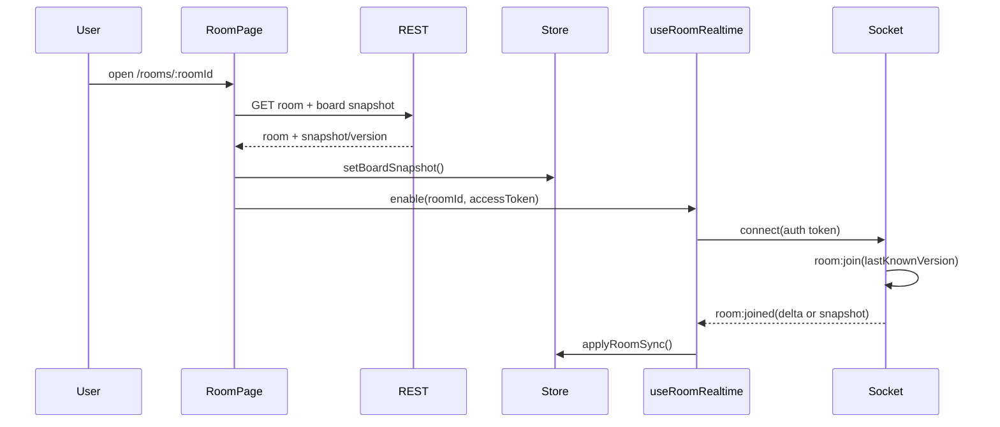

### 9.2 Board mutation + optimistic create

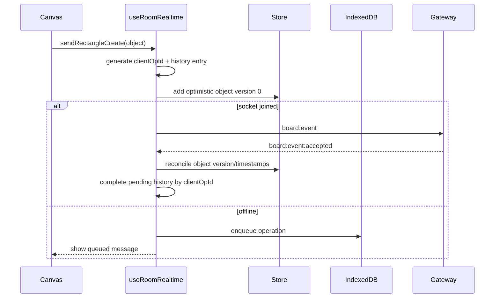

### 9.3 Offline replay and conflict

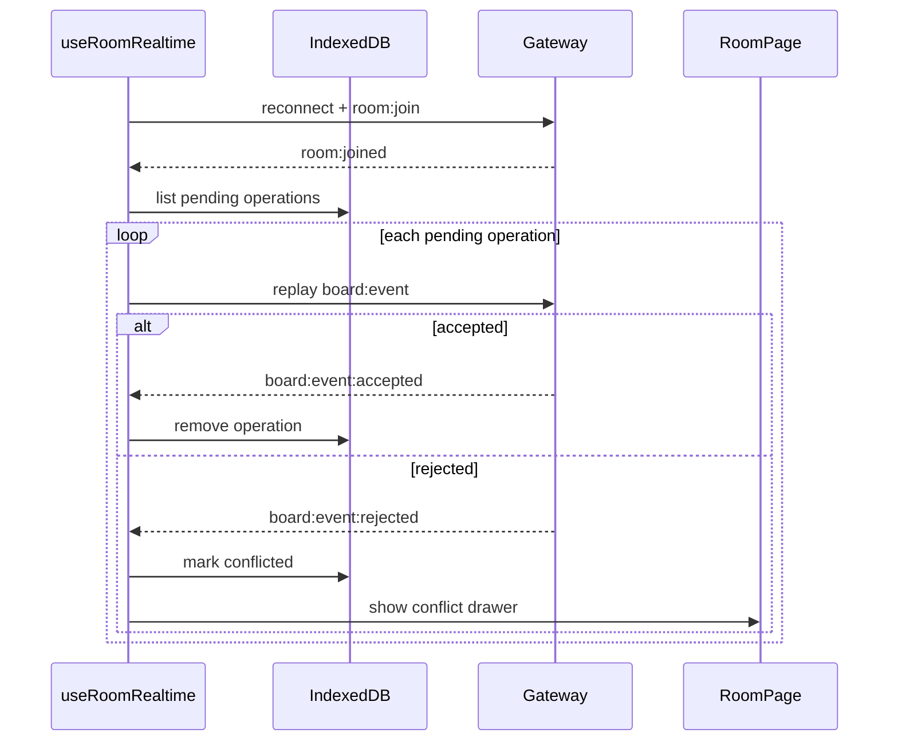

### 9.4 Undo/redo

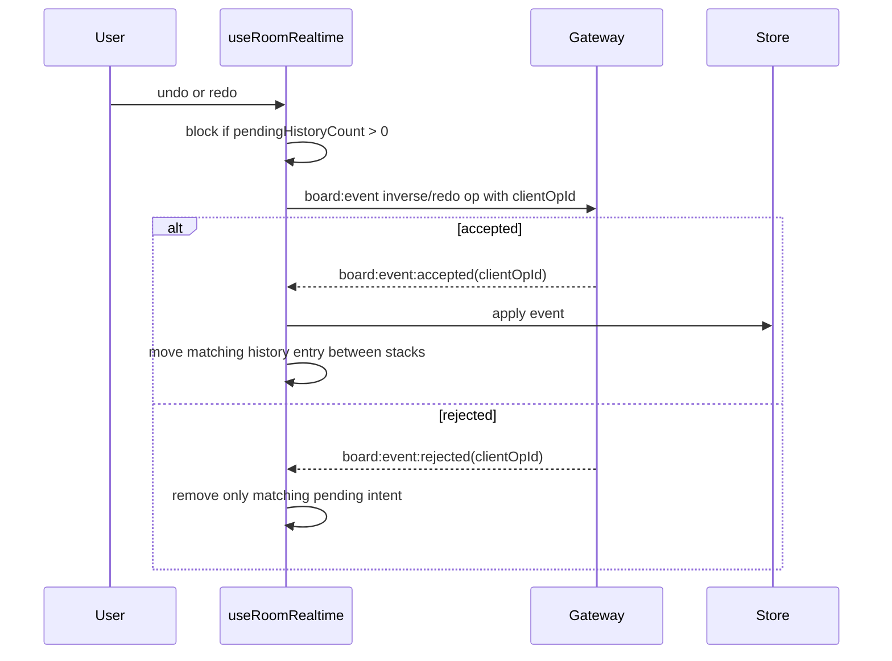

Undo/redo là client-side history, không phải server-side command history. ACK/reject matching dùng `clientOpId`, không còn phụ thuộc FIFO đơn giản.

### 9.5 Restore snapshot

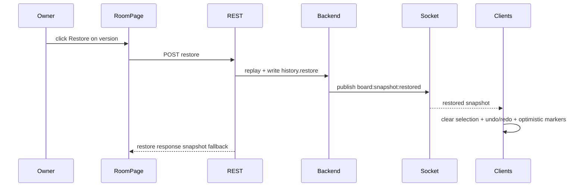

### 9.6 Comments

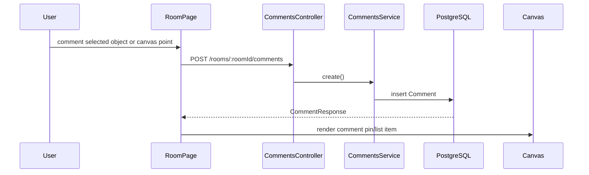

Comments hiện là REST/panel flow. Chưa có `comment:*` Socket.IO broadcast, nên client khác cần reload/refresh để thấy comment mới.

## 10. Operations and configuration

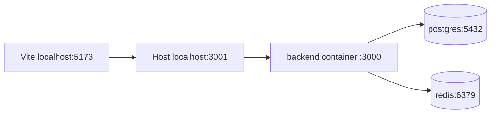

Default ports:

| Service | Host port | Container port |
|---|---:|---:|
| Frontend Vite | `5173` | local process |
| Backend | `3001` | `3000` |
| PostgreSQL | `5432` | `5432` |
| Redis | `6380` | `6379` |

Important env vars:

| Var | Purpose |
|---|---|
| `DATABASE_URL` | Prisma connection; host uses `localhost`, container uses `postgres` |
| `REDIS_URL` | Redis connection; host uses `localhost:6380`, container uses `redis:6379` |
| `BACKEND_PORT` | Backend host/container port mapping |
| `POSTGRES_*` | Local database user/password/db/port |
| `REDIS_PORT` | Host Redis port |
| `CORS_ORIGIN` | REST and Socket.IO allowed frontend origins |
| `VITE_API_BASE_URL` | Frontend REST + Socket.IO base URL |
| `JWT_ACCESS_SECRET` | JWT signing secret |
| `JWT_ACCESS_TTL` | Access token TTL |
| `REFRESH_TOKEN_TTL_DAYS` | Refresh session expiry |

Backend Dockerfile behavior:

1. Uses `node:22-alpine`.
2. Installs with `pnpm install --frozen-lockfile`.
3. Copies backend/shared sources and Prisma schema.
4. Runs `prisma generate` and `nest build`.
5. Starts with `prisma migrate deploy && node dist/main.js`.

## 11. Testing

Current tests:

| Area | Files | Coverage focus |
|---|---|---|
| Auth | `backend/src/auth/auth.controller.spec.ts` | Register, login, refresh rotation, logout, `/auth/me` |
| Board | `backend/src/board/board.service.spec.ts` | Create/update/delete, snapshot, reconnect sync, conflicts |
| Permissions | `backend/src/permissions/room-permissions.spec.ts` | Role policy helpers |
| Realtime | `backend/src/realtime/room.gateway.spec.ts` | Socket auth, join, presence, board ACK/reject, text lease |
| Presence | `backend/src/realtime/presence.service.spec.ts` | Multi-socket presence removal |
| Rooms | `backend/src/rooms/rooms.controller.spec.ts` | Room CRUD, member APIs, role enforcement |
| Versions | `backend/src/rooms/version-history.controller.spec.ts` | List/tag/detail version APIs |
| Board UI/store | `frontend/src/board/*.test.ts` | Store reducers, object rendering helpers, viewport drag |
| Realtime helpers | `frontend/src/realtime/useRoomRealtime.test.ts` | Permission helpers, payload helpers, conflict formatting |
| Version helpers | `frontend/src/versions/versionHistory.test.ts` | Tag filtering and labels |

Gaps:

- No automated browser E2E scripts in package scripts for multi-client Socket.IO scenarios.
- Comments controller/service has no dedicated test file.
- Restore realtime is implemented, but multi-browser confirmation should be covered by Playwright/Cypress later.
- Out-of-order ACK/reject behavior is partly protected by design; a hook-level integration test would make it safer.

## 12. Feature status matrix

| Feature | Status | Notes |
|---|---|---|
| Auth + refresh rotation | Complete | Register returns user, login/refresh return tokens |
| Room CRUD + invite join | Complete | Join by invite creates viewer membership |
| Role-based permissions | Complete | REST guard and Socket gateway both enforce role |
| Board event sourcing | Complete | Snapshot + append-only event log |
| Reconnect sync | Complete | Delta if <= 50 missed events, otherwise snapshot |
| Multi-cursor | Complete for live presence | Redis TTL state, no persisted cursor history |
| Remote selection/editing indicator | Complete for live state | Broadcast selected/editing object ids |
| Soft text lock | Complete for whole-text editor | TTL lease, deny if another user owns active lease |
| Yjs text persistence | Implemented | Yjs state persisted, UI is still textarea-based |
| Comments/annotations | Functional | REST only, no realtime comment broadcast |
| Offline outbox | Functional | IndexedDB pending/conflicted operations |
| Conflict resolution | Functional for object updates | Field-level stale update merge; same-field reject |
| Undo/redo | Functional client-side | ACK matched by `clientOpId`; disabled while pending |
| Restore version | Complete | Writes `history.restore` and emits realtime snapshot |
| Redis Socket.IO adapter | Implemented | Used when `REDIS_URL` exists |
| Production hardening | Partial | Needs rate limiting, metrics, tracing, deployment review |

## 13. Known limitations and recommended next work

1. Add realtime comments.
   - Add `comment:created`, `comment:updated`, `comment:deleted` events or broadcast from `CommentsService`.
   - This removes the current “refresh panel to see others' comments” limitation.

2. Add browser E2E for collaboration.
   - Cover two clients editing, restore broadcast, cursor/selection, offline replay, out-of-order ACK/reject.
   - This is the highest-value safety net for this codebase.

3. Finish ownership transfer.
   - Current backend blocks owner self-role-change/self-remove.
   - Add explicit transfer command so rooms always retain an owner.

4. Deepen collaborative text editing.
   - Current backend persists Yjs updates, but UI commits whole text.
   - A richer editor could bind Yjs text directly and expose true per-character collaboration.

5. Harden multi-instance transient state.
   - Redis adapter fans out socket events, but presence service is process-memory and cursor/selection maps are memory-first with Redis TTL writes.
   - For real multi-node production, add cross-instance presence/cursor bootstrap or server-side state queries.

6. Add operational hardening.
   - Rate limit auth/socket events, add structured logs, metrics, tracing, health/readiness checks, and stricter production CORS/secret validation.

## 14. Source-of-truth notes

- `README.md` and `AGENTS.md` match the current Docker backend + local frontend flow.
- `CLAUDE.md` still contains older notes about Redis/shared socket event names; do not use it as the current operational source of truth.
- `frontend/.env.local` should contain `VITE_API_BASE_URL=http://localhost:3001` for this local setup.
